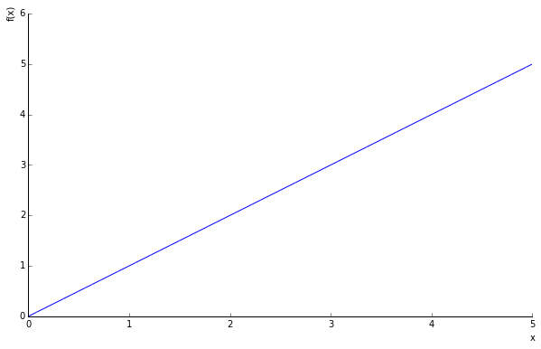
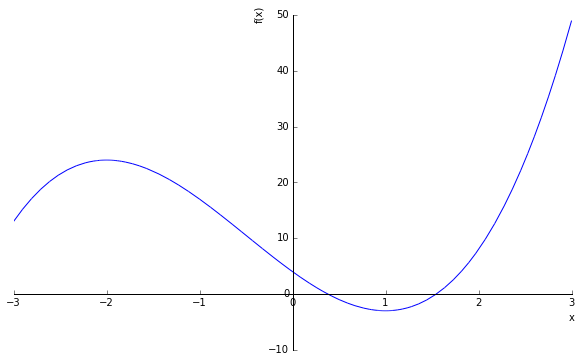

# Evaluating Functions
Here we review two methods for evaluating functions: (1) substitution and (2) graphically

## Substitution
Using the substitution method, we can simply substitute a value in an equation or function to evaluate the result.  For example, assume that we have the following:

$$y = 2x + 3$$

We could rewrite this to be:

$$f(x) = 2(x) + 3$$

Then we could evaluate this function for $$f(2)$$ by substituting $$2$$ into all places we see $$x$$:

$$f(2) = 2(2) + 3$$ or $$f(2) = 7$$.  

It is possible to evaluate the above function in any number of places:

* For f(-2): $$f(-2) = 2(-2) + 3$$
* For f(11): $$f(11) = 2(11) + 3$$
* For f(0): $$f(0) = 2(0) + 3$$

The complexity of the function does not alter the method.  For example, assume that the function is $$f(t) = 3t^{2} - 2t + 4$$.  What would the solution for $$t=2$$ and $$t=-1$$ be?

* $$t(2) = 3(2^{2}) - 2(2) + 4 = 3(4) - 4 + 4 = 12 - 4 + 4 = 12$$
* $$t(-1) = 3(-1^{2}) - 2(-1) + 4 = 3(2) + 2 + 4 = 6 + 6 = 12$$

What would happen if we had the following function:  $$f(x) = 3x - 4$$ and we wanted to evaluate it for: $$f(x + h)$$?  As above we simply substitute.  Every place we see $$x$$ in the function, we simply substitute $$x + h$$:

$$f(x + h) = 3(x + h) - 4  = 3x + 3h - 4$$

Finally, we can combine evaluations and algebraic simplification.  Assume the same function $$f(x) = 3x - 4$$ and evaluate $$f(x + h) - f(x)$$.

Here, I break out the simplification:

* $$f(x + h) - f(x) = (3x + 3h - 4) - (3x - 4)$$
* $$= 3x + 3h - 4 - 3x + 4$$
* $$= 3x - 3x + 3h - 4 + 4$$
* $$= 3h$$

#### Supplemental Video

---------------

### Simplification, then substitution
Remember, that it is also frequently necessary to apply algebraic simplification before substitution.  By way of example, assume we have the following equation:  $$16 = 7x + 2$$.  We could rewrite this as a function $$f(x)$$, but would first need to simplify.  Using that approach:

$$f(x) = 7x - 14$$

Then we substitute and solve.

Alternatively, we could solve the equality:

* $$16 - 2 = 7x + 2 - 2$$  (Subtract 2 from both sides of the equality)
* $$14 = 7x$$
* $$\frac{14}{7} = \frac{7x}{7}$$
* $$2 = x$$

#### Supplemental Video

## Graphically

When given a function, we can also graphically evaluate it.  We can do this using pen and paper by using sequential substitution over some domain.  For example, assume we have the function $$f(x) = x$$ over the domain [0,5].  

|f(x)|x|
|----|-|
|f(0)|0|
|f(1)|1|
|f(2)|2|
|f(3)|3|
|f(4)|4|
|f(5)|5|

If we graph these, we see:

Here we see the equation $$y = 2x^{3} + 3x^{2} -12x + 4$$.  Just like the simple example above, we can define a domain ($$\{x \in \mathbb{R} | x \in [-3,3]\}$$ in this case).  We then substitute some of the data values from the domain into the equation to generate the graph.

|f(x)|x|
|----|-|
|f(-3)|13|
|f(-2)|24|
|f(-1)|17|
|f(0)|4|
|f(1)|-3|
|f(2)|8|
|f(3)|49|

