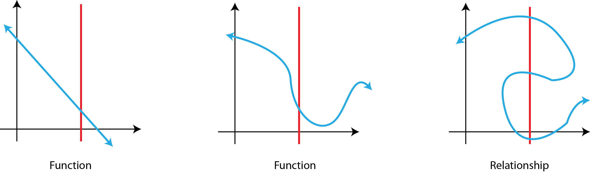
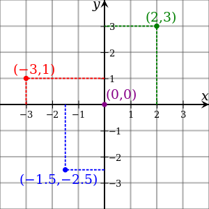
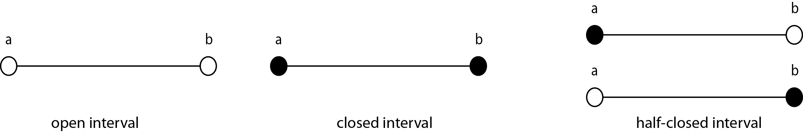

# Functions

Here we describe what a function is, what a domain for which a function is valid is, and what intervals are.

At the most basic, a function is a colelction of unknown variables.  For example:

$$x + y + 3z = 21$$

or more generically:

$$f(x, y, z)$$

or extremely generically:

$$f()$$

## Functions vs. Relationships

A function describes a relationship between inputs and outputs such that each input maps to exactly one output.  Image that the figure below was for the production of widgets.  We have a set of inputs: 'green', 'blue', 'red', and 'orange' and a set of output: 'circle', square', 'triangle' and 'rectangle'.  Inputting an input color or *variable* ($$x$$) results in each output shape or *value* ($$f(x)$$). We can then say that *shape is a function of color*.

A function is a subset of what are more broadly defined as relations and the distinction between a relation and a function has to do with the number of possible output values.  A function maps an input value to one, and only one, output value.  Using the above example, if we input 'red' into our function and got back either 'circles' or 'squares', we would have a relationship.  If we knew that the returned value would always be a 'circle', we have a function.

Graphically, if were to draw a vertical line at an arbitrary $$x$$ point and the resulting $$f(x)$$ was unique, we would have a function.  The figure below illustrates that distinction.  On the left, we have a simple linear function describable generically as $$f(x)$$ (read f-of-x) or more specifically as $$y = mx + b$$ (the standard equation of a line).  In the center, we have a more complex function that can still be abstractly notated as $$f(x)$$.  Finally, the right-hand image is **not** a function.  Here we have multiple potential vaules of $$f(x)$$ for the $$x$$ represented by the red line.  This is a relationship.

   

> Note: Throughout this text, functions will largely be notated as $$f(x)$$.  This is simply by convention.  It is equally valid to utilize $$g(x)$$, $$t(x)$$, $$h(t)$$, etc.  

### Types of Relations
Above we reviewed the standard equation of a line ($$y = mx + b$$).  This equation describes a linear relationship.  One unit increase in $$y$$ has a corresponding unit increase in $$x$$.  The relationship between these is linear.  When we see a function or equation that contains only $$+$$ or $$-$$ operations, the relationship is linear.  For example:

* $$x + y$$
* $$2x + y$$
* $$\frac{1}{4}y - x$$    

Intuitively, a non-linear relationship indicates that variables will not change in a linear fashion.  For example, $$x^{2}$$.  Increases in $$x$$ do not follow a line, but are, in this case, exponential.  Other examples of non linear relations are:

* $$\sqrt{z}$$
* $$x * y$$
* $$\log{a}$$

#### Supplemental Video

------

## Functions vs. Equations
What differentiates an equation from a function?  Assume that we have the following equation:$$x + 2 = 5$$  Here we see an equal sign ($$=$$) denoting an equivilency.  An equation is defining a relationship ($$\gt, \lt, \leq, \geq, \neq$$).  When we notate a function $$f(b)$$, we do not have the equivelency constraint.  Not all functions are equations and not all equations are necessarily functions. 

#### Supplemental Video

------

## Domains
A function need not be generically applicable to anything you could possible throw at it.  For example, the above color-to-shape function might not be able to accept '11' as a variable and return any meaningful output.  We there for define a domain, or a range of acceptable input variables, for a given function.

Some commonly used domains include:

* Real Numbers (denoted by $$\mathbb{R}$$)
	*  Rational Numbers
		*  Integers: -4, 0, 2, 10, ... (denoted by $$\mathbb{Z}$$)
		*  Fractions: 1/10, 1/3, 0.1, 0.04
		*  Prime Number: 2,3,5,7,... (denoted by $$\mathbb{P}$$)
	*  Irrational Numbers (denoted by $$\mathbb{I}$$)
		*  	$$\sqrt{2}$$, $$\pi$$

When defining a function, it also important to define the domain for which the function is valid.  We do this using some interval.

You will frequently encounter domains notated as $$\{x \in \mathbb{R}\}$$, which can be read as 'all $$x$$ in the set of real numbers'.  

### Cartesian Coordinate Systems

As geographers, we often work in a two-dimensional, Cartesian coordinate system.  The units in this coordinate systems are real numbers, and the planar domain is notated as $$\mathbb{R}^2$$.  Coordinates in this domain are identified by the ordered pair (x,y) and have some defined origin (typically (0,0)).

 

Here we could using the notation $$\{(x,y) \in \mathbb{R}^{2}\}$$ meaning 'all points in the cartesian plane'.

#### Supplemental Video

------

## Intervals
Intervals are used in conjunction with a domain to further constrain potential inputs to a function.  We can broadly define two types of intervals:

* Open Interval: An open interval does not include the endpoints of the given domain.  For example $$ a < x < b$$.  The left hand image of the figure below illustrates an open interval.  We notate an open interval using parenthesis: $$(a, b)$$.

* Closed Interval: A closed interval does include the endpoints of a given domain.  For example $$a \leq x \leq b$$.  The central image of the figure below illustrates a closed interval.  We notate a closed interval using square brackets: $$[a,b]$$.

Finally, it is possible to mix open and closed intervals:

* $$a < x \leq b$$  Notated: $$(a, b]$$
* $$a \leq x < b$$ Notated: $$[a, b)$$

Mixed open and closed intervals are shown in the right hand image of the figure below.

   

Using the notation from above $$\{x \in \mathbb{R} \}$$, we can include an interval definition as well.  For example, if $$-10 < x < 10$$ and the domain is $$\mathbb{R}$$, we can write $$\{x \in \mathbb{R} | x \in (-10,10) \}$$, meaning 'all real number values of $$x$$ between, greater than -10 and less than 10.

#### Supplemental Video

