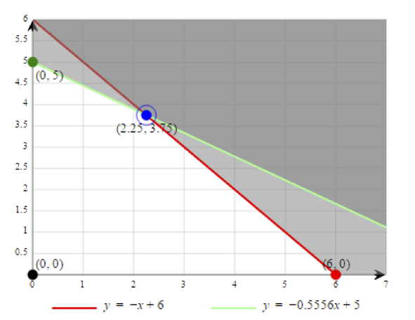
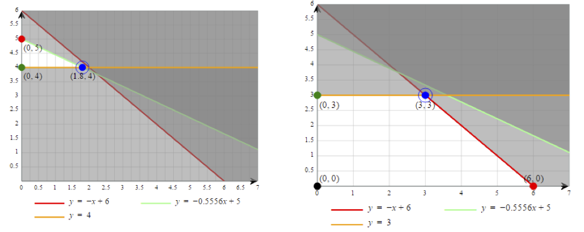
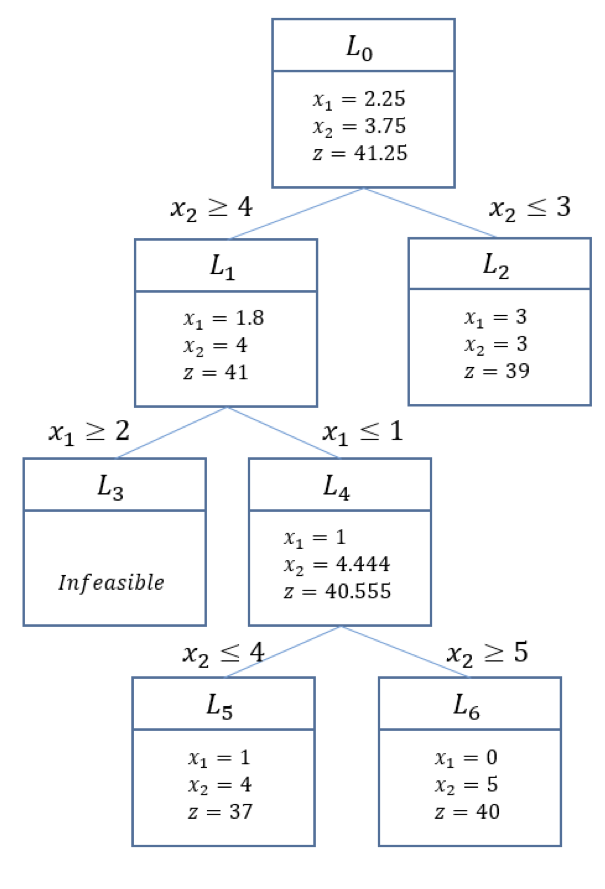

# Integer Programming Example (Branch and Bound)

As mentioned in the previous section, integer problem cannot be solved by the simplex method. However, it can be efficiently solved by an extension of it, so called Branch and bound (B&B) method. Since the objective value of a linear problem is the upper bound of integer problem, we can structure branching procedure.

1. Ignore integer requirement and solve the problem as an LP
2. Attempt to solve any fractional solution variable through branch integer value below & above
3. Four instances are possibly encountered after a branch
    * Feasible IP solution identified, best bound
    * Fractional result
    * Problem infeasible (fathom)
    * Feasible IP, but worse bound (fathom)
4. Continue with all branches are fathomed, with only best feasible IP node remaining

## Example

Let’s take a look of procedure of B&B method with an example.

*max* $$5x_{1} + 8x_{2}$$

*s.t.*

$$x_{1} + x_{2} \leq 6$$

$$5x_{1} + 9x_{2} \leq 45$$

$$x_{1}, x_{2} \geq 0$$ *and integer* 

Like previous example, this problem is integer problem. But to apply B&B method, we must relax integer restriction.

*max* $$5x_{1} + 8x_{2}$$

*s.t.*

$$x_{1} + x_{2} \leq 6$$

$$5x_{1} + 9x_{2} \leq 45$$

$$x_{1}, x_{2} \geq 0$$

As this problem is a maximization problem, the objective value of the linear problem is always the upper bound of the objective value of the integer programming problem. If we solve this problem, solution is:

$$z = 41.25$$, $$x_{1} = 2.25$$, $$x_{2} = 3.75$$

And following figure is a graphic depiction of solution space. White area is the feasible area.

Since the coefficient in the object function are integral, $$z$$ must be integral and this implies the upper bound will be 41: $$z \leq 41$$.

We have solution such that $$x_{1} = 2.25$$ and $$x_{2} = 3.75$$. Both variables must be integer in the optimal solution, and we can divide the feasible area to try to make them integer. For example, $$x_{1} \leq 2$$ or $$x_{1} \geq 3$$ as it should be integer. Likewise, $$x_{2} \leq 3$$ or $$x_{2} \geq  4$$. For now, we will divide the feasible area using $$x_{2}$$.

We can describe B&B procedure in an enumeration tree. The tree is branching by new constraints for $$x_{2}$$. Constraints are joined to existing constraints. So for $$L_{1}, x_{2} \geq 4$$ is joined the constraints set of $$L_{0}$$,

*max* $$5x_{1} + 8x_{2}$$

*s.t.*

$$x_{1} + x_{2} \leq 6$$

$$5x_{1} + 9x_{2} \leq 45$$

$$x_{2} \geq 4$$

$$x_{1}, x_{2} \geq 0$$

The strategy of B&B method is obvious: Simply treat each subdivision as we did original problem. Consider $$L_{2}$$ first. If we solve this problem with given constraints, solution is $$x_{1} = 1.8$$, $$x_{2} = 4$$, $$z= 41$$. Since $$x_{1}$$ is not an integer, we need to divide it more, into the regions $$L_{3}$$ with $$x_{1} \geq 2$$ and $$L_{4}$$ with $$x_{1} \leq 1$$.  
In $$L_{3}$$ however, it is infeasible, so this branch no longer needs to be considered.

Let’s check $$L_{4}$$. Note that $$L_{4}$$ has constraints from $$L_{4}$$, and also additionally $$x_{2} \geq 4$$ and $$x_{1} \leq 1$$. 

If we solve this problem, solution is $$x_{1} = 1$$, $$x_{2} = 4.444$$, $$z = 40.555$$. Since $$x_{2}$$ is not integer, we should branch this solution with $$x_{2} \leq 4$$ ($$L_{5}$$), and $$x_{2} \geq 5$$ ($$L_{6}$$). Now we have three branches to be considered, namely $$ $$L_{2}$$, $$L_{5}$$, $$L_{6}$$. In practice, several heuristics are utilized to select a branch to be solved first for efficient solution process, but for here, we will just pick up $$$$L_{5}$$.

In $$L_{5}$$, we can get the optimal solution such that $$x_{1} = 1$$, $$x_{2} = 4$$, and $$z = 37$$.  Now finally we have a solution that satisfies the original integer constraints. As it is not possible to get better solution from this branch, there is no point to make subdivision from this branch. From the solution of $$L_{5}, we have the lower bound for the original problem, so now we have bounds $$37 \leq z \leq 41$$. It gets closer, but we still have branches to examine.

In $$L_{6}$$, the only solution is $$x_{1} = 0, x_{2} = 5, z = 40$$. Now we have better solution, and the bounds is $$40 \leq z \leq 41$$.  We might stop here, as possible integer objective values are 40 and 41, but just in case we get a better solution (41) in $$L_{2}$$, let’s finish the job.

In $$L_{2}, our solution is $$x_{1} = 3, x_{2} = 3, z = 39$$. This is inferior solution to $$L_{5}, so the optimal solution for the original integer programming is $$x_{1} = 0, x_{2} = 5, z = 40$$.

## Conclusion
As you can see, solving a branch and bound problem requires the repeated application of the simplex method, with additional constraints to maintain the integer requirement.  In practice, we never solve problems like these by hand; they are much too complex.  In fact, once the problems become sufficiently difficult, it may not be feasible to find an optimal solution using the Branch and Bound approach.  In those cases a heuristic solution method is applied.
