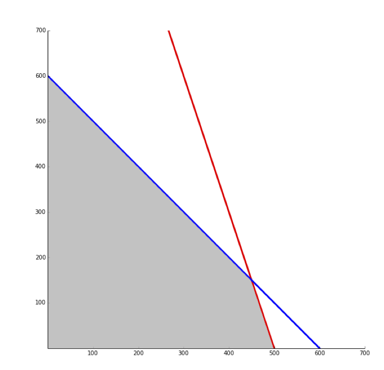

# Introduction

## Linear Programming

The optimization model that you formulated last week were mathematical expressions of some real world problem.  To obtain optimal results, we need to apply some kind of solution technique. One of such techniques is linear programing (LP).

Formally, linear programing is a technique that optimize linear objective function, subject to linear constraints (equality and/or inequality).

Definition of Linear Programing for optimization problem:

1. Maximization or minimization a linear function (objective function)
2. Decision variables must satisfy entire set of constraints
3. Sign restriction associated with each variables

Assumptions of LP:

1. Proportionality & additivity
    - Contribution of a variable to objective function is proportional to each variable
    - Contribution of variable to objective function is independent of other decision variables
    - Contribution of each variable to left hand side (LHS) of each constraint is proportional to value of
variable
    - Contribution of a variable to LHS of each constraint is independent of other variables
2. Divisibility
    - Each variable can assume fractional values
3. Certainty
    - Each of our parameters are known with certainty

To apply linear programing algorithm, problems needs to be expressed in canonical form. Canonical form is basically matrix/vector version of the above mentioned models. In general:

*Maximize* $cx$

s.t. (subject to)

$$Ax \leq$$ b

$$x \geq b$$

Where $$x$$ represents vector of decision variables, $$c$$, $$b$$ are vectors of known coefficient, and **A** is a matrix of known coefficient.

## Solution By Graph

How can we solve linear optimization problem? There are several ways, and one of the simplest method is the graphical approach.  We can depict equality or inequality as a graph. In case of inequality, we can fill the area that satisfy inequality with a shade.

Consider the following problem:

Suppose a toy company makes two types of wagons, X and Y. Let us further assume that during any work period, each X takes 3 hours to construct and 2 hours to paint, while each Y takes 1 hour to construct and 2 hours to paint. Finally, the maximum number of hours allotted for construction is 1500 and the limit on hours available for painting is 1200 hours. If the profit on each X is $50 and the profit on each Y is $60, how many of each type of wagon should be produced to maximize the profit?

Decision variables are the number of toys, X and Y. Objective function is:

*Maximize* $$50X + 60Y$$

*s.t.*

$$3X + Y \leq 1500$$

$$2X + 2Y \leq 1200$$

$$X, Y \geq 0$$

We can draw graphs of all constraints to find out region of feasibility, the area that satisfies all given constraints. In following figure, gray shaded area is region of feasibility. Every single point in the feasible area are feasible, but only one of them is the optimal solution. To find the optimal solution, we use the fundamental theorem of linear programing.

The fundamental theorem of linear programing:

Let K be a convex region of feasibility in the xy-plane. Then the objective function takes both maximum and minimum values, if they exist, on one or more vertices of K.

Therefore, we can put value of four vertices of above feasible region to the objective function, and compare them to find maximum value.

Vertices: (0,0), (0,600), (450,150), (500,0) (0,0) → 0

(0,600) → 36000

(450,150) → 31500

(500,0) → 25000

Therefore, we can archive maximum profit when we manufacture 0 of X and 600 of Y.
