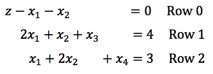

# Simplex Method

With the graphical approach, it is possible ti solve simple problems.  Unfortunately, more complex problems are not feasibly solved grahically.  One numerical way to solve linear programming models is the Simplex Method.

To apply simplex method, first we need to convert a given problem into standard form, not canonical form. It is simple. Below system of equations is written in standard form.

*Maximize* $$ z = c_{1}x_{1} + c_{2}x_{2} + \ldots + c_{n}x_{n}$$

*s.t.*

$$a_{11}x_{1} + a_{12}x_{2} + \ldots + a_{1n}x_{1n} \leq b_{1}$$

$$a_{21}x_{1} + a_{22}x_{2} + \ldots + a_{1n}x_{n} \leq b_{2}$$

$$\ldots$$

$$a_{m1}x_{1} + a{m2}x_{2} + \ldots + a_{mn}x_{n} \leq b_{m}$$

$$x_{1]} \geq 0, \ldots x_{n} \geq 0 $$

  - If the objective function is minimization of z, convert it to max –z (make it negative)
  - If a constraint is ( ) ≤ 𝑏𝑖, then convert it into an equality constraint by adding a nonnegative slack variable. The resulting constraint is ( ) + 𝑠𝑙𝑎𝑐𝑘 𝑣𝑎𝑟𝑖𝑎𝑏𝑙𝑒 = 𝑏𝑖. Put a slack variable for each inequality in constraints.  (The example will illustrate the use of slack variables.)

## Example
Here I use an example to walk through the simplex algorithm and define the rules that make the simplex algorithm work.  I would suggest skimming this text once, not worrying too much if something does not make 100% sense.  Then reread the example and work through the problem - focus on those sections that might not make total sense (and definitely ask questions!).

Imagine a problem that has been formulated as:

*Maximize* $$z = x_{1} + x_{2}$$

*s.t.*

$$2x_{1} + x_{2} \leq 4$$

$$x_{1} + 2x_{2} \leq 3$$

$$x_{1},x_{2} \geq 0$$

Now we should change inequality to equality, by adding slack variables ($$x_{3}$$, $$x_{4}$$). One for each constraint. For objective function, move decision variables to left hand side. All elements in right hand side should be constants.

This is beginning to look like a system of linear equations.  The objective function has become the first row and each constraints has become a subsequent row.  Notice that $$x_{3}$$$$ and $$ $$x_{4}$$ have been added.  Where did those variables come from?  They are the **slack variables** that are added to allow for the conversion from $$\leq$$ to = (inequality to equation).

Note that there are variables that appear in only one equation, such as $$x_{3}$$ and $$x_{4}$$. They are called basic variables (**BV**). Other variables that appear in multiple equations, $$x_{1}, x_{2}$$ are called nonbasic variables (**NBV**). A basic feasible solution is obtained from the system of equations by setting the NBVs to zero.

Definitely, nobody want 0 as a solution and objective value. How can we increase $$z$$?

We can increase $$z$$ by increasing $$x_{1} and $$ $$x_{2}$$, because $$x_{1}$$ and $$x_{2}$$ have negative coefficients (see Row 0). If all coefficients are nonnegative, we can conclude that current basic solution is optimum, as there is no way to increase $$z$$. From this, here is the first rule of the simplex method.

> Rule 1: if all variables have a nonnegative coefficient in Row 0, the current basic solution is optimal. Otherwise, pick a variable with the most negative coefficient in Row 0.

The variable chosen by Rule 1 is called the entering variable. Here let us choose, say, 𝑥1 as our entering variable. The idea is to pivot in order to make the nonbasic variable 𝑥1 to the basic variable. In the process, some basic variables will become nonbasics (the leaving variables). This change of basis is done using the elementary row operations. What is needed next is to choose the pivot element. It will be found using Rule 2 of the simplex method.

> Rule 2: Divide each of positive element in the work column (column with entering variable) into the corresponding row entry element in the right hand side (RHS). Choose the pivot row as being one with minimum ratio.

Steps of simplex is like followings.
1. Change all inequalities into equations via the use of slack variables. One slack variable for each inequality.
2. Rewrite the objective function, z, in terms of slack variables, setting one side of the equation equal to zero and keeping the coefficient of z equal to +1.
3. The number of equations should equal the sum of the constraints plus one (the equation given by the objective function).
4. Form the initial tableau, labeling the columns, beginning with the z and then decision variables, followed by the slack variables. Put equation based on objective function in Row 0. The last column, RHS, should have all the “constants.”
5. Locate the most negative number in Row 0 (if more than one equally negative number is present, arbitrarily choose any one of them), since NBV with most negative variable has the largest influence the objective value. This is entering variable. This column will be called the work column.
6. Consider each positive element in the work column. Divide each of these elements into the corresponding row entry element in the last column. The ratio that is the smallest will be used as the work column’s pivot. If there is more than one smallest ratio, arbitrarily choose any one of them.
7. Use elementary row operations to change the pivot element to 1, unless it is already 1.
8. Use elementary row operations to transform all the other elements in the work column to 0. That
is making entering variable BV.
9. Repeat the process until there are no negative elements in the last row.
10. We are then able to determine the answers from this final tableau.
