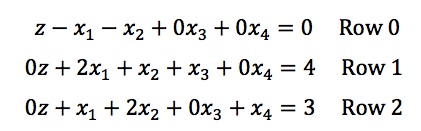
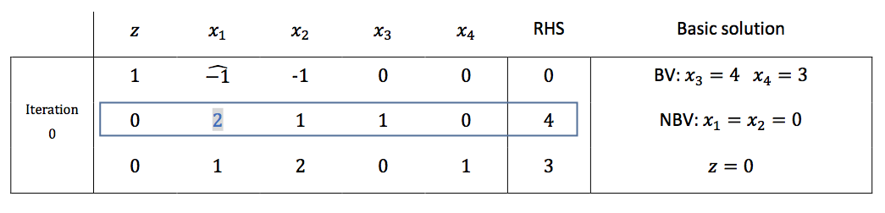
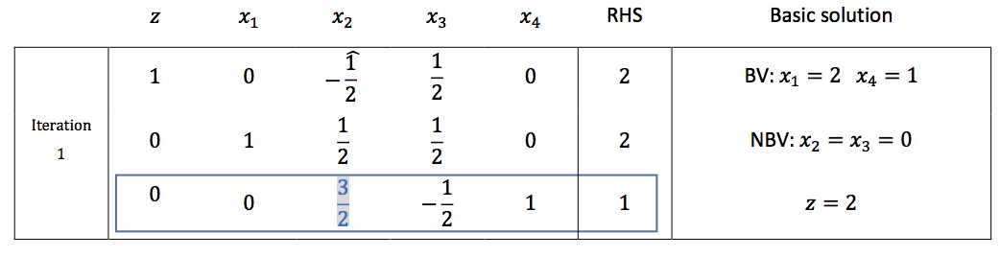
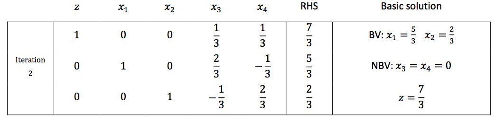

# Simplex Example

In this section, we will solve the previous optimization problem using the simplex method.

Here is the previous optimization problem in matrix form:

Remember, all initial **BV**s should be eliminated from Row 0, by having 0 coefficient.

Then initialize tableau form. Coefficient of entering variable wears a hat. As coefficient of BV is always 1, you can easily recognize which variable is BV. A pivot element for each iteration written in blue with shade.

At the initial iteration, as coefficients of both decision variables are identical, pick any one of them. Here we select 𝑥1 as the entering variable. Then we need to determine the pivot element. Calculate ratio of
each element in work column, except the element in Row 0. 42 = 2 and 31 = 3. We should choose lesser one, so 2 (Row 1) is pivot element, and Row 1 is pivot row.

Next step is making coefficient of the pivot element to 1. Then we make other elements in work column to 0 by elementary row operation, to make 𝑥1 to the basic variable. We will not visit every step of elementary row operation here. But I recommend solve this problem by yourself. Result is like below.

Basic solution of 1st iteration is:

$$x_{1} = 2, x_{4} = 1, x_{2} = x_{3} = 0, z = 2$$

Is this solution optimal? Not yet, as we still have the negative coefficient in Row 0. Naturally, 𝑥2
becomes the new entering variable. To select the pivot, calculate the ratio $$\dfrac{2}{1/2} = 4$$, $$\dfrac{1}{3/2} = \dfrac{2}{3}$$, so $$\dfrac{3}{2}$$ is the pivot element.  The result is:

Now we have no negative coefficient in Row 0. So the simplex algorithm terminates here. Optimized solution & objective value:

$$x_{1} = \dfrac{5}{3}$$, $$x_{2} = \dfrac{2}{3}$$, $$z = \dfrac{7}{3}$$

We don’t need to worry about slack variables, as they are NBV, so value is equal to 0.
