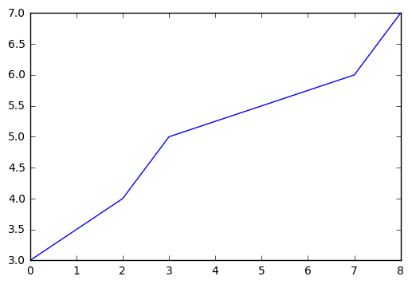

# Network Distances
Network distance is, unsurprisingly, a measurement of the cost to traverse a network or to travel between a node and some other, arbitrary node.  As a network is traditionally composed of nodes and edges, the 'cost' of travel is the aggregated cost of travel from the origin node, across some other set of nodes, to the destination node.  Intuitively, the cost of travel from Tempe to Flagstaff is the aggregated cost of travel over many different roads (edges).

## Cost Metrics
Once we begin to discuss network distance, we are implying that the graph edges are weighted.  A large number of possible cost metrics exist to weight each edge.  For example:

* Travel Distance - what is the Euclidean length of each edge?
* Travel Cost - what is the weighted distance, where the weighting can be from road type, traffic levels, turn direction costs (e.g., left turns are more expensive), etc.?
* f(slope and river type) - what is the function of river size and topographic slope that might help determine the speed with which water (or a boat) travels on a hydrography network.

## Shortest Path (Euclidean vs. Network)
Recall that we have already introduced Euclidean distance metrics, Manhattan distance, and the algorithm to compute the total length of a multi-segment polyline.  Here, we simply illustrate the potential error in selecting an appropriate distance measure.

Imagine that the image below is for a road in a network.  The 'road' is composed of 5 nodes: [(0, 3), (2, 4), (3, 5), (7, 6), (8, 7)].

If we compute the Euclidean distance, the total road length is ~8.94 units.  Using manhattan distance the total travel distance is 12 units.  What is the actual travel distance, constrained to the road? Approximately 9.18 units.  As the road is not particularly [sinuous](http://www.sinuousgame.com/), Euclidean distance is a relatively good approximation.
