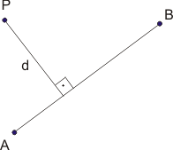
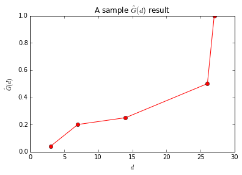

# Network Constrained Point Processes

Way back in [Chapter 5](../Chapter5/usage.html), we concluded the section on probability with a very general view of network contrained quadrat counts.  The general idea was that, on a network, area is not a valid measure (as the polylines have no area).  It is possible to substitute length though and apply the quadrat counting methodology.  In this section, we leverage Monte Carlo simulation, computational geometry, and nearest neighbor distance metrics to apply a network constrained point pattern analysis method.

# Snapping and Distributing Points Along a Network
Observational data is generally captured and recorded in Cartesian (as opposed to network) space.  This could be FourSquare checking data or twitter data, manually collected GPS data, or street aggregated health or crime data.  Each of these data collection methodologies presents that chance to apply different mathematical models to render network constrained observations.

In the absence of any more complex rules, it is a reasonable assumption to 'snap' individual observations to the nearest line on a road newtork.  How is that acheived?  (The solution below is not the most efficient, but I think it is the most straight forward.  Another option would be to use a linear algebra approach and vector representations.)

* We first must solve a generalized problem - given a line defined by two points of indeterminant length, compute the distance from a point to the infinitely long line.  

$$Distance(P_{1}, P_{2}, (x_{0}, y_{0}) = \dfrac{|(y_{2} - y_{1})x_{0} - (x_{2} - x_{1})y_{0} + x_{2}y_{1} - y_{2}x_{1}|}{\sqrt{(y_{2} - y_{1})^{2} + (x_{2} - x_{1})^{2}}}$$,

where $$P_{1} = (x_{1}, y_{1})$$, $$P_{2} = (x_{2}, y_{2})$$, and $$(x_{0}, y_{0})$$ is the point.

* Compute the distance between each end point of the line segment.
* The minimum of those three values is the distance from a given point to a line segment.
* Once we know the minimum distance, snap the point to either one of the line's endpoints, or some coordinate along the line.  In the case of the latter, we can compute the coordinates because we know that the point to be snapped to the line exists on a line perpindular to the network segment.

The wording on the last bullet is not ideal, but I hope that this image offers some insight.  We know that the shortest distance between P and the line AB is the perpindicular defined as d.  With this information, we have a number of options for computing the interesection point, including the method presented in the line intersection section of Chapter 6.

# G-Function

One metric that can be used to determine if a point process (network constrained or not) is clustered (or evenly distributed, so not CSR) is the G function.  The G function is defined as:

$$\hat{G}(d) = \dfrac{count(nearest neighbor \leq d)}{N}$$, 

that is, at a user defined number of distance bands ($$N$$), how many nearest neighbor distance are $$\leq$$ D.  

The resultant figure could look something like:

where the y-axis is simply the count - once all of the observations have been included the above equation equals 1.0.

The above figure was generated for a spatial programming course using cartesian coordiantes and a non-random point pattern.  The formula above is agnostic to the representation.  The challenge in working with a network is that all distances computed (as you did last week) must be network constrained.  That means that the observations might need to be snapped to the network first, and then the nearest, network constrained, neighbor distances computed.  Once that is completed, the G-Function can be computed. 
