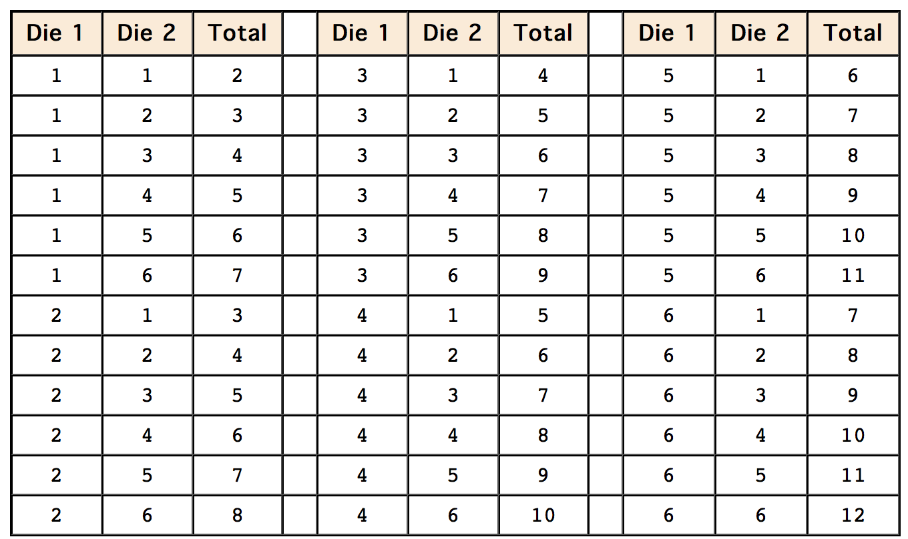

# Basics of Probability
As with the Introduction to Probability chapter, this chapter is also drawn from the [Online Statistics Education] text.

## Probability of a Single Event

If you roll a six-sided die, there are six possible outcomes, and each of these outcomes is equally likely. A six is as likely to come up as a three, and likewise for the other four sides of the die. What, then, is the probability that a one will come up? Since there are six possible outcomes, the probability is 1/6. What is the probability that either a one or a six will come up? The two outcomes about which we are concerned (a one or a six coming up) are called favorable outcomes [^1]. Given that all outcomes are equally likely, we can compute the probability of a one or a six using the formula:

$$probability = \dfrac{Number of Favorable Outcomes}{Number of Possibly Equally-Likely Outcomes}$$

In this case there are two favorable outcomes and six possible outcomes. So the probability of throwing either a one or six is 1/3. Don't be misled by our use of the term "favorable," by the way. You should understand it in the sense of "favorable to the event in question happening." That event might not be favorable to your well-being. You might be betting on a three, for example.

The above formula applies to many games of chance. For example, what is the probability that a card drawn at random from a deck of playing cards will be an ace? Since the deck has four aces, there are four favorable outcomes; since the deck has 52 cards, there are 52 possible outcomes. The probability is therefore 4/52 = 1/13. What about the probability that the card will be a club? Since there are 13 clubs, the probability is 13/52 = 1/4.

Let's say you have a bag with 20 cherries: 14 sweet and 6 sour. If you pick a cherry at random, what is the probability that it will be sweet? There are 20 possible cherries that could be picked, so the number of possible outcomes is 20. Of these 20 possible outcomes, 14 are favorable (sweet), so the probability that the cherry will be sweet is 14/20 = 7/10. There is one potential complication to this example, however. It must be assumed that the probability of picking any of the cherries is the same as the probability of picking any other. This wouldn't be true if (let us imagine) the sweet cherries are smaller than the sour ones. (The sour cherries would come to hand more readily when you sampled from the bag.) Let us keep in mind, therefore, that when we assess probabilities in terms of the ratio of favorable to all potential cases, we rely heavily on the assumption of equal probability for all outcomes.

Here is a more complex example. You throw 2 dice. What is the probability that the sum of the two dice will be 6? To solve this problem, list all the possible outcomes. There are 36 of them since each die can come up one of six ways. The 36 possibilities are shown below.

You can see that 5 of the 36 possibilities total 6. Therefore, the probability is 5/36.

If you know the probability of an event occurring, it is easy to compute the probability that the event does not occur. If P(A) is the probability of Event A, then 1 - P(A) is the probability that the event does not occur. For the last example, the probability that the total is 6 is 5/36. Therefore, the probability that the total is not 6 is 1 - 5/36 = 31/36.

## Probability of Two (or more) Independent Events

Events A and B are independent events [^2] if the probability of Event B occurring is the same whether or not Event A occurs. Let's take a simple example. A fair coin is tossed two times. The probability that a head comes up on the second toss is 1/2 regardless of whether or not a head came up on the first toss. The two events are (1) first toss is a head and (2) second toss is a head. So these events are independent. Consider the two events (1) "It will rain tomorrow in Houston" and (2) "It will rain tomorrow in Galveston" (a city near Houston). These events are not independent because it is more likely that it will rain in Galveston on days it rains in Houston than on days it does not.

### Probability of A and B

When two events are independent, the probability of both occurring is the product of the probabilities of the individual events. More formally, if events A and B are independent, then the probability of both A and B occurring is:

    P(A and B) = P(A) x P(B)

> Here we see a change in notation from P(A $$\cap$$ B).  We also see the mathematical solution to computing the probability of A and B occuring.  It is the product of the probabilities.  This mathematical formulation is only valid if A and B are independent.

where P(A and B) is the probability of events A and B both occurring, P(A) is the probability of event A occurring, and P(B) is the probability of event B occurring.
If you flip a coin twice, what is the probability that it will come up heads both times? Event A is that the coin comes up heads on the first flip and Event B is that the coin comes up heads on the second flip. Since both P(A) and P(B) equal 1/2, the probability that both events occur is 1/2 x 1/2 = 1/4.

Let's take another example. If you flip a coin and roll a six-sided die, what is the probability that the coin comes up heads and the die comes up 1? Since the two events are independent, the probability is simply the probability of a head (which is 1/2) times the probability of the die coming up 1 (which is 1/6). Therefore, the probability of both events occurring is 1/2 x 1/6 = 1/12.

One final example: You draw a card from a deck of cards, put it back, and then draw another card. What is the probability that the first card is a heart and the second card is black? Since there are 52 cards in a deck and 13 of them are hearts, the probability that the first card is a heart is 13/52 = 1/4. Since there are 26 black cards in the deck, the probability that the second card is black is 26/52 = 1/2. The probability of both events occurring is therefore 1/4 x 1/2 = 1/8.

### Probability of A or B

If Events A and B are independent, the probability that either Event A or Event B occurs is:

    P(A or B) = P(A) + P(B) - P(A and B)

In this discussion, when we say "A or B occurs" we include three possibilities:

1. A occurs and B does not occur
1. B occurs and A does not occur
1. Both A and B occur 

This use of the word "or" is technically called inclusive or because it includes the case in which both A and B occur. If we included only the first two cases, then we would be using an exclusive or.

> The notation page indicates that an **or** relationship is notated as: P(A $$\cup$$ B).  It did not make a distinction between inclusive and exclusive or. 

Now for some examples. If you flip a coin two times, what is the probability that you will get a head on the first flip or a head on the second flip (or both)? Letting Event A be a head on the first flip and Event B be a head on the second flip, then 

    P(A) = 1/2, P(B) = 1/2, 

and 
    
    P(A and B) = 1/4. 

Therefore, 

    P(A or B) = 1/2 + 1/2 - 1/4 = 3/4.

If you throw a six-sided die and then flip a coin, what is the probability that you will get either a 6 on the die or a head on the coin flip (or both)? Using the formula,

    P(6 or head) = P(6) + P(head) - P(6 and head)
             = (1/6) + (1/2) - (1/6)(1/2
             = 7/12

An alternate approach to computing this value is to start by computing the probability of not getting either a 6 or a head. Then subtract this value from 1 to compute the probability of getting a 6 or a head. Although this is a complicated method, it has the advantage of being applicable to problems with more than two events. Here is the calculation in the present case. The probability of not getting either a 6 or a head can be recast as the probability of

    (not getting a 6) AND (not getting a head).

This follows because if you did not get a 6 and you did not get a head, then you did not get a 6 or a head. The probability of not getting a six is 1 - 1/6 = 5/6. The probability of not getting a head is 1 - 1/2 = 1/2. The probability of not getting a six and not getting a head is 5/6 x 1/2 = 5/12. This is therefore the probability of not getting a 6 or a head. The probability of getting a six or a head is therefore (once again) 1 - 5/12 = 7/12.

If you throw a die three times, what is the probability that one or more of your throws will come up with a 1? That is, what is the probability of getting a 1 on the first throw OR a 1 on the second throw OR a 1 on the third throw? The easiest way to approach this problem is to compute the probability of

    NOT getting a 1 on the first throw
    AND not getting a 1 on the second throw
    AND not getting a 1 on the third throw.

The answer will be 1 minus this probability. The probability of not getting a 1 on any of the three throws is 5/6 x 5/6 x 5/6 = 125/216. Therefore, the probability of getting a 1 on at least one of the throws is 1 - 125/216 = 91/216.

### Conditional Probabilities
Often it is required to compute the probability of an event given that another event has occurred. For example, what is the probability that two cards drawn at random from a deck of playing cards will both be aces? It might seem that you could use the formula for the probability of two independent events and simply multiply 4/52 x 4/52 = 1/169. This would be incorrect, however, because the two events are not independent. If the first card drawn is an ace, then the probability that the second card is also an ace would be lower because there would only be three aces left in the deck.

Once the first card chosen is an ace, the probability that the second card chosen is also an ace is called the conditional probability[^3] of drawing an ace. In this case, the "condition" is that the first card is an ace. Symbolically, we write this as:

The vertical bar "|" is read as "given," so the above expression is short for: "The probability that an ace is drawn on the second draw given that an ace was drawn on the first draw." What is this probability? Since after an ace is drawn on the first draw, there are 3 aces out of 51 total cards left. This means that the probability that one of these aces will be drawn is 3/51 = 1/17.P(ace on second draw | an ace on the first draw)

	If Events A and B are not independent, then P(A and B) = P(A) x P(B|A).

Applying this to the problem of two aces, the probability of drawing two aces from a deck is 4/52 x 3/51 = 1/221.

One more example: If you draw two cards from a deck, what is the probability that you will get the Ace of Diamonds and a black card? There are two ways you can satisfy this condition: (a) You can get the Ace of Diamonds first and then a black card or (b) you can get a black card first and then the Ace of Diamonds. Let's calculate Case A. The probability that the first card is the Ace of Diamonds is 1/52. The probability that the second card is black given that the first card is the Ace of Diamonds is 26/51 because 26 of the remaining 51 cards are black. The probability is therefore 1/52 x 26/51 = 1/102. Now for Case B: the probability that the first card is black is 26/52 = 1/2. The probability that the second card is the Ace of Diamonds given that the first card is black is 1/51. The probability of Case B is therefore 1/2 x 1/51 = 1/102, the same as the probability of Case A. Recall that the probability of A or B is P(A) + P(B) - P(A and B). In this problem, P(A and B) = 0 since a card cannot be the Ace of Diamonds and be a black card. Therefore, the probability of Case A or Case B is 1/102 + 1/102 = 2/102 = 1/51. So, 1/51 is the probability that you will get the Ace of Diamonds and a black card when drawing two cards from a deck.

### Birthday Problem
If there are 25 people in a room, what is the probability that at least two of them share the same birthday. If your first thought is that it is 25/365 = 0.068, you will be surprised to learn it is much higher than that. This problem requires the application of the sections on P(A and B) and conditional probability.

This problem is best approached by asking what is the probability that no two people have the same birthday. Once we know this probability, we can simply subtract it from 1 to find the probability that two people share a birthday.

If we choose two people at random, what is the probability that they do not share a birthday? Of the 365 days on which the second person could have a birthday, 364 of them are different from the first person's birthday. Therefore the probability is 364/365. Let's define P2 as the probability that the second person drawn does not share a birthday with the person drawn previously. P2 is therefore 364/365. Now define P3 as the probability that the third person drawn does not share a birthday with anyone drawn previously given that there are no previous birthday matches. P3 is therefore a conditional probability. If there are no previous birthday matches, then two of the 365 days have been "used up," leaving 363 non-matching days. Therefore P3 = 363/365. In like manner, P4 = 362/365, P5 = 361/365, and so on up to P25 = 341/365.

In order for there to be no matches, the second person must not match any previous person and the third person must not match any previous person, and the fourth person must not match any previous person, etc. Since P(A and B) = P(A)P(B), all we have to do is multiply P2, P3, P4 ...P25 together. The result is 0.431. Therefore the probability of at least one match is 0.569.

### Gambler's Fallacy
A fair coin is flipped five times and comes up heads each time. What is the probability that it will come up heads on the sixth flip? The correct answer is, of course, 1/2. But many people believe that a tail is more likely to occur after throwing five heads. Their faulty reasoning may go something like this: "In the long run, the number of heads and tails will be the same, so the tails have some catching up to do."

[^1]: A favorable outcome is the outcome of interest. For example one could define a favorable outcome in the flip of a coin as a head. The term "favorable outcome" does not necessarily mean that the outcome is desirable – in some experiments, the favorable outcome could be the failure of a test, or the occurrence of an undesirable event.

[^2]: Events A and B are independent events if the probability of Event B occurring is the same whether or not Event A occurs. For example, if you throw two dice, the probability that the second die comes up 1 is independent of whether the first die came up 1. Formally, this can be stated in terms of conditional probabilities: P(A|B) = P(A) and P(B|A) = P(B).

[^3]: The probability that event A occurs given that event B has already occurred is called the conditional probability of A given B. Symbolically, this is written as P(A|B). The probability it rains on Monday given that it rained on Sunday would be written as P(Rain on Monday | Rain on Sunday).