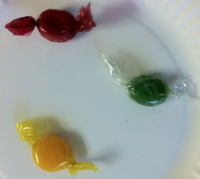

# Permutations
The permutations and combinatinos chapters are also drawn from the wonderful Online Statistics Eudcation text.

## Possible Order
Suppose you had a plate with three pieces of candy on it: one green, one yellow, and one red. You are going to pick up these three pieces one at a time. The question is: In how many different orders can you pick up the pieces? Table 1 lists all the possible orders. There are two orders in which red is first: red, yellow, green and red, green, yellow. Similarly, there are two orders in which yellow is first and two orders in which green is first. This makes six possible orders in which the pieces can be picked up. 

The six possible orders are:

| **Number**	| First |	Second | Third |
|---------|-------|--------|-------|
|1	|red	|yellow |	green|
|2	|red	|green	|yellow
|3	|yellow|	red	|green
|4	|yellow|	green	|red
|5	|green|	red	|yellow
|6	|green|	yellow	|red

The formula for the number of orders is shown below.

	Number of orders = n!

where n is the number of pieces to be picked up. The symbol "!" stands for factorial. Some examples are:

	3! = 3 x 2 x 1 = 6
	4! = 4 x 3 x 2 x 1 = 24
	5! = 5 x 4 x 3 x 2 x 1 = 120
	
> This notation should look familiar.  We could easily rewrite this (albiet more verbosely) using Pi notation.

This means that if there were 5 pieces of candy to be picked up, they could be picked up in any of 5! = 120 orders. 

## Multiplication Rule
Imagine a small restaurant whose menu has 3 soups, 6 entrées, and 4 desserts. How many possible meals are there? The answer is calculated by multiplying the numbers to get 3 x 6 x 4 = 72. You can think of it as first there is a choice among 3 soups. Then, for each of these choices there is a choice among 6 entrées resulting in 3 x 6 = 18 possibilities. Then, for each of these 18 possibilities there are 4 possible desserts yielding 18 x 4 = 72 total possibilities.

## Permutations

Suppose that there were four pieces of candy (red, yellow, green, and brown) and you were only going to pick up exactly two pieces. How many ways are there of picking up two pieces? Table 2 lists all the possibilities. The first choice can be any of the four colors. For each of these 4 first choices there are 3 second choices. Therefore there are 4 x 3 = 12 possibilities.

|Number|	First	|Second|
|------|---------|------|
|1	|red|	yellow
|2|	red|	green
|3	|red|	brown
|4|	yellow	|red
|5	|yellow|	green
|6	|yellow|	brown
|7|	green|	red
|8	|green	|yellow
|9|	green|	brown
|10	|brown|	red
|11 |brown	|yellow
|12	|brown|	green

More formally, this question is asking for the number of permutations of four things taken two at a time. The general formula is:

$$ _{n}P_{r} = \dfrac{n!}{(n-r)!}$$

where $$_{n}P_{r}$$ is the number of permutations of $$n$$ things taken $$r$$ at a time. In other words, it is the number of ways r things can be selected from a group of n things. In this case,

$$_{4}P_{2} = \dfrac{4!}{(4-2)!} = \dfrac{4 \cdot 3 \cdot 2 \cdot 1}{2 \cdot 1} = 12$$

It is important to note that order counts in permutations. That is, choosing red and then yellow is counted separately from choosing yellow and then red. Therefore permutations refer to the number of ways of choosing rather than the number of possible outcomes. When order of choice is not considered, the formula for combinations is used.

#### Supplemental Video

