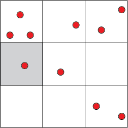

# Uses of Distirbutions in GIScience

## Point Processes
This week, we considered the binomial distirbution and saw that the distirbution can be used to model the probability of sequential, independent events, e.g. a coin toss.  In the case of the coin toss, this was a discrete probability distribution that was visualized as a histogram.  We can also identify a probability distirbution function, $$f(x)$$ that describes a continuous probability.  In this case, we have some curve (described by $$f(x)$$) and using that curve can compute the probability of some even taking on some value.

What then, does this look like in the context of point processes?  I will use an example drawn from Geographic Information Analysis (2nd Edition), written by David O'Sullivan and Mark Unwin.

Imagine that we have a study are $$\mathbb{R^{2}}$$ that is broken into 9 quadrants.  We can refer to this space partioning as a lattice.  In that lattice, we have 10 observations.

What is the probability that an independent observation will occur in any quadrant?

P(A) = P(area of the study area in the given quadrant) = $$\dfrac{1}{9}$$

This is because the total study area is encompassed by all of our observations and any given quadrant contains only $$\dfrac{1}{9}$$ of the total study area.

What then, is the probability that a given observation will occur in the shaded grid cell **and** no other observation will be observed in that frid cell?  In other words, what is the probability that a given grid cell will contain one, and only one, observation?

$$P(A_{alone}) = \dfrac{1}{9} x \dfrac{8}{9} x \dfrac{8}{9} x \dfrac{8}{9} x \dfrac{8}{9} x \dfrac{8}{9} x \dfrac{8}{9} x \dfrac{8}{9} x \dfrac{8}{9} x \dfrac{8}{9}$$

In other words, given 10 independent observations the probability that a grid cell will contain one, and only one observation is equal to the probability that one observation will be in the cell ($$\dfrac{1}{9}$$) times the probabilities that all other observations will be in another grid cell $$\dfrac{8}{9}$$.

We can expand this concept and focus not just on a single grid cell, but on all grid cells.  Specifically, we can ask the same question above ten times:

$$P(A_{alone}) = 10 x \dfrac{1}{9} x \dfrac{8}{9} x \dfrac{8}{9} x \dfrac{8}{9} x \dfrac{8}{9} x \dfrac{8}{9} x \dfrac{8}{9} x \dfrac{8}{9} x \dfrac{8}{9} x \dfrac{8}{9}$$

This then generalizes to 

$$P(\text{k events}) = \text{Number of possible combinations of k events} x (\dfrac{1}{9})^{k} \cdot (\dfrac{8}{9})^{\text{number of observations} -k}$$, where 

$$k$$ is the number of events observed per quadrant.

We learned last week that the number of possible combinations is simply:

$$_{n}C_{r} = \dfrac{n!}{(n-r)!r!}$$

so, we can substitute the variable k for the variable n ($$n = k$$) and notate

$$P(\text{k events}) = _{k}C_{\text{number of observations}} \cdot (\dfrac{1}{9})^{k} \cdot (\dfrac{8}{9})^{\text{number of observations} - k}$$

Knowing that can have between 0 and 10 observations per quadrant, we can compute the probability that $$k=0$$, $$k=1$$, $$\ldots$$, $$k=10$$ for a given quadrant.  By doing this, we are get a probability distribution function that describes the probability of observing a given point pattern.  This function is a binomial distribution!

We therefore have

$$P(k, n, x) = _{k}C_{n} \cdot (\dfrac{1}{x})^{k} \cdot (\dfrac{x-1}{x})^{(n-k)}$$, 

where $$k$$ is the number of events observed per quadrant, $$n$$ is the total number of events, and $$x$$ is the total number of quadrants the study area has been partitioned into.

At this point, you may be wondering why any of this matters.  What does having $$P(k, n, x)$$ tell us?  Knowing $$P(k,n,x)$$ means that we can mathematically predict the probability seeing a point pattern with a given distribution over $$\mathbb{R}^{2}$$.  We can compute the binomial distribution for $$k$$ and check whether the observered pattern follows our expected probability distribution.  If we see that k=4 in two quadrants, we could determine that the observed pattern is does not meet the CSR (Complete Spatial Randomness) constraint.

## Poisson Distribution
The above is all well and good.  Until you have ~50 observations.  At that point, calculating values of $n$ greater than 50 ($$50!$$) could become tricky.  The poisson distribution is a good stand-in for the binomial distribution and many spatial point pattern analysis methods utilize the poisson distribution.

## Network Constrained Point Processes
To highlight a bit more of the applicability of these methods, we can look to network constrained point patterns.  That is, point patterns in $$\mathbb{R}^{2}$$ that are also constrained to a network (for example a road network).  In this case, we can estimate a probability distribution function:

$$f(x) = \dfrac{1}{|L|} for x \in L$$, 

where $$|L|$$ is the length of the network (the sum of all of the lengths of the roads using a street network as an example).  Here, the above point process formula is applicable, with a simple modification.  We no longer use quadrant area to compute the probability of observing some number of events in a given quadrant (in the above example, we used $$\dfrac{1}{9}$$ as the probability of event A being observed in one of nine quadrants).  If we have a network, what metric is used instead of area ( in other words, what metric is the demoninator in the previous fraction)?

Knowing this probability distirbution function, we can then estimate the probability that a given road segment (a single street perhaps) contains $$k$$ observations and start to assess whether the observed pattern is random or not. 

