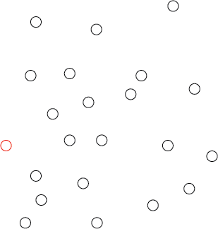
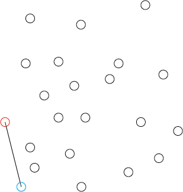
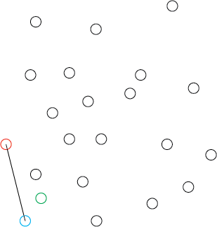
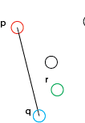
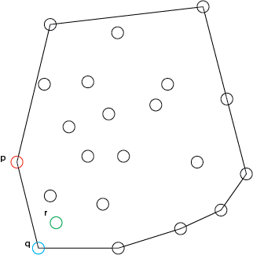

# Convex Hulls

Convex hulls find wide usage in Geographic Information Systems.  A few uses include: (1) shortest path with obstacle avoidance algorithms computed in geometric (as opposed to graph) space, (2) accessability maps, and (3) computation of minimum bounding geometries for optimum location siting and network analysis.  All of these use cases focus on leveraging the same information: what is the minimum geometry that can be identified that includes a given set of points.

## Gift Wrapping Algorithm

One of the most basic (though effective) algorithms for computing a convex hull is the gift wrapping algorithm (Jarvis, 1973).  The algorithm starts by selecting an extreme point that is known to be on the boundary of the point set (and therefore a vertex of the hull polygon).  Traditionally, this is the leftmost point (red).

* Select the leftmost point, $$p$$.

The leftmost point is selected as the starting point.

* Keep searching for the counter-clockwise most point in the pattern until we return to the start point (leftmost).  Once we return to the start, we have created a polygon.

* Select the furthest point to the right point, relative to point $$p$$.  We will call this point $$q$$.

The blue point is the further to the right with respect to $$p$$, but how did we find that? (1) naively, we need to check all of the other available points and see if the line between the red and blue points is a turn.  By this, I mean, if the newly selected point to the left (or right) of all other points.  I say left (or right) because as we traverse around the points our perspective keeps changing - the current end point is the point that we are viewing the point pattern from.  

How then can we check a turn?  We need to select another point in the point pattern.

The 'other' point, in green.  We now need to know if the green point lies to the left of the line connecting the red and the blue point.  If it does, the blue point is a farther right turn than the green point.  

A closeup of the situation.  We need an algorithm to compute if q is to the left of r.

Lets define possible turns as left, right, and none.  We know the coordinates of the points.

$$p = (1,3)$$
$$q = (2,0)$$
$$r = (3,1)$$

And we know that we can compute the differences in those point coordinates, specifically the differences in x and differenes in y.  Using:

$$(q_{x} - p_{x})*(r_{y} - p_{y}) - (r_{x} - p_{x} * q_{y} - p_{y})$$

Lets test this for the example visualized above.

$$(2 - 1)*(1 - 3) - (3 - 1)*(0 - 3) = -2 - -6 = 4$$

So we get a positive number if the line pq if to the right of point r.

Now move $$r$$ to the other side with $$r = (1,0)$$

$$(2-1)*(0-3) - (1-1)*(0-3) = -3 - 0 = -3$$

So we get a negative number of the point is  to the left of pq.  If the result is 0, the points are colinear. 

Now that we know how to find point q we can complete the algorithm to find the convex hull.
 
To recap:

* Select the leftmost point, $$p$$.

* Keep searching for the counter-clockwise most point in the pattern until we return to the start point (leftmost).  Once we return to the start, we have created a polygon.

	* Select the furthest point to the right point, relative to point $$p$$.  We will call this point $$q$$.
	* Set point q as the new point p and repeat the search process.

Repeating searching for q and then setting $$q = p$$ and repeating the search process until we return to our starting point results in a convex hull that wraps all of the points.
