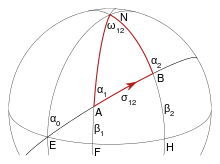
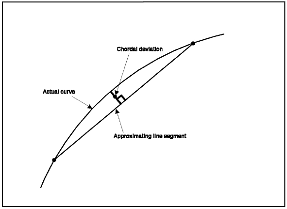
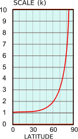

# Distances 
A foundational idea in computational geometry is distance.  How far apart are two points in $$\mathbb{R}^{2}$$?  What about two vectors?  The foundational idea of distance is then integrated into more complex algorithms that can compute things like, how do we simplify a line? (One answer is to look at how far a point is from the start and finish points of a line and determine whether or not it can be safely removed.)

Distance is easy right.  We covered distance in the first few weeks of class by reviewing what Pythagoras told us 2000 years ago.  Why might we want to look at distance again?

The table below shows the distance, in kilometers between Chicago and Minneapolis (center columns) and New York and New Orleans (right columns).  If you were piloting a craft with a finite fuel supply, would you be okay with the discrepencies in distances?  Of course not!  

|Method|Chicago-Minneapolis|New York-New Orleans|
|------|-------------------|--------------------|
|Geodetic | 562.0km | 1897.2km|
|Naive Euclidean | 706.0km | 2172.4km|
|Chord | 561.8km | 1890.2km |
|Mercator | 773.7km | 2336.5km |
|Sinusoidal | 562.1km | 1897.7km |
|Centroid-based | 562.2km | 1901.5km|

From: Banerjee (2005). On geodetic distance computations in spatial modeling. Biometrics. 61, 2 p. 617-25.

### Types of Distance

* Geodetic distance is the shortest path along the [ellipsoid](https://en.wikipedia.org/wiki/Earth_ellipsoid), at sea-level, between two points.  In the image below, this is the distance between E and B (or A and B, or ...).  The path follows the ellipsoid (or more simplified auxillary sphere).  If the slew of terminaology from geodesy is brand new, the important take away is that geodesic distance is **the** actual distance.

* Naive Euclidean distance is the distance that we computed previously.  The distance that Pythagoras identified.  $$d = \sqrt{(x_{1} - x{2})^{2} + (y_{1} - y_{2})^{2}}$$.  The issue here is that a spherical body (Earth, Moon, Mars, etc.) is not flat.  We artifically flatten the earth into a plane (without projection) using Euclidean distance and, as you can see above, the error we induce only increases with the true distance between the two objects.

* Chordal distance seeks to solve some of the issue cause by Euclidean distance by computing the distance between two points (A and B) on a sphere as the distance along a line (AB) that pierces the sphere.  The figure below (copyright IBM, used without permission for educational purposes only) illustrates chordal distance.  Looking at the table above, chordal distance is pretty close (depending on your use case) at Chicago to Minneapolis distances and a little bit poorer for New York to New Orleans.

* Mercator, Sinusoidal and centroid-based (adaptive projection) approaches are all map projections of the sphere.  The mercator projection does not preserve distance measurements (as seen by the large errors in the above table.)  In fact, distance scaling is a function of latitude (see the image below)!  The sinusoidal projection does a better job of preserving distance computation, but is not without error when off of the standard-parallels.  Finally, centroid based methods are adaptive projections (with all of the pros and cons of adaptive projections that are well beyond the focus of this discussion). 

Latitude dependent scale effects on the computation of distance for the Mercator projection.

### Computing Distance

So, distances are tricky.  Computationally, since we are talking about computational geometry and computational thinking, a general rule of thumb is the more error you are willing to accept in your distance computation, the less expensive it is to compute.

* Geodesic Distance - I will leave it to you to skim (and just skim) the [formulation](https://en.wikipedia.org/wiki/Vincenty%27s_formulae).  The problem is non-trivial and not simplistic to implement.  I will not ask you to compute geodesic distances by hand.
* Chordal distance - To compute the chordal distance through a sphere utilize:

$$\Delta X = \cos\phi_{2} \cdot \cos\lambda_{2} - \cos\phi_{1} \cdot \cos\lambda_{1};$$

$$\Delta Y = \cos\phi_{2} \cdot \sin\lambda_{2} - \cos\phi_{1} \cdot \sin\lambda_{1};$$

$$\Delta Z = \sin\phi_{2} - \sin\phi_{1}$$;

$$C = \sqrt{(\Delta X)^{2} + (\Delta y)^{2} + (\Delta Z)^{2}}$$, 

where $$\phi_{1}, \lambda_{1}$$ and $$\phi_{2}, \lambda_{2}$$ are the latitude and longitude of two points.

* Map projected distance.  Once we are in projected space, we can utilize Euclidean distance metrics and are constrained by the characteristics of the projection.

