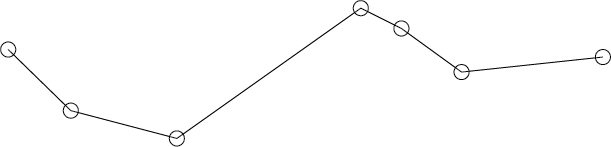
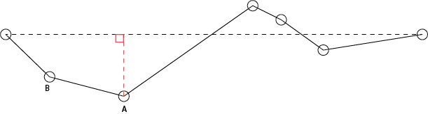
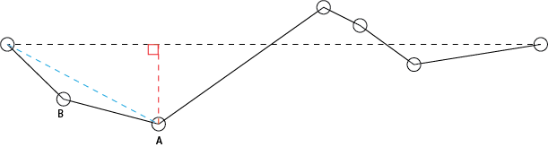
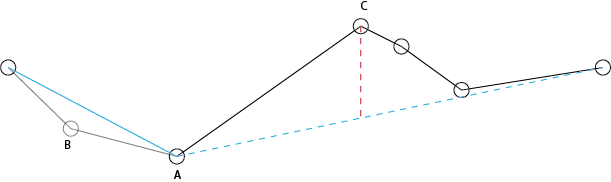
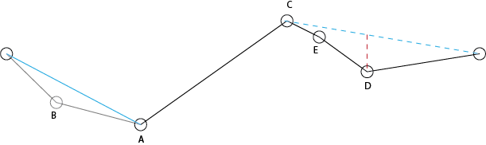
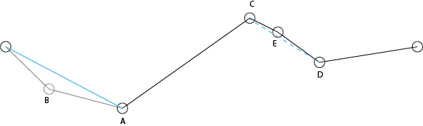
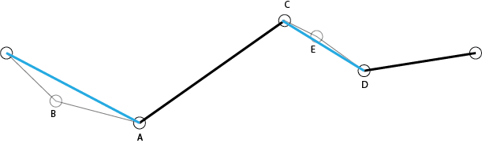

# Line Simplification

The Douglas-Peucker line simplification algorithm is a wonderful example of a computational geometry approach to solving a GIS question.  How can a complex line segment be represented using less vertices?  Check out [Mike Bostock's awesome D3 implementation](https://bost.ocks.org/mike/simplify/) of the algorithm to see what the simplification looks like in practice.

The algorithm functions by:

* Define some $$\epsilon$$ as the maximum distance a line can be deformed by removing a vertex.
* Add the start and stop vertices to the set of vertices to be included (if we remove the start and stop, we change the spatial extent!)

Our initial starting line.

* Mark all of the other vertices as being kept (for now).

* Draw a line between the start and stop points.  Compute the [distance between all points and said line](https://en.wikipedia.org/wiki/Distance_from_a_point_to_a_line).

The black dashed line connects the start and stop vertices.  The red dashed line is the distance from the black dashed line to the farthest point.  For this example, assume that $$distance(A) > \epsilon$$.

* If the farthest point from the line connecting the start and finish is closer than $$\epsilon$$, we can remove all other points.  If the vertex is further than epsilon, we repeat the above process recursively.  This means that we draw a new line connecting the start with the most distant point and then the most distance point to the stop.

The light blue line connects the start point with the most distant point (A).  We then compute the distance between the light blue line and B.  This step should be familiar (this is the recursive part, we keep applying the same operations over and over again).  For this example, we assume that $$distance(B) < \epsilon$$ and so B is removed.  We then repeat the process with a line connecting point A and the stop.

* Recirsively remove vertices.

The light blue line now connects A with the end node and the furthest point, C is identified.  $$distance(C) > \epsilon$$ so C is kept.

The light blue line now connects C with the end node and the furthest point, D is identified.  $$distance(D) > \epsilon$$ so D is kept.

The light blue line now connects C with D and the furthest point, E is identified.  $$distance(E) < \epsilon$$ so E is removed.

The final line is show (with the path bold).  Points B and E were removed as their removal was within the $$\epsilon$$ constraint.

### A question
Would the algorithm change if you altered the method by which distance was computed?