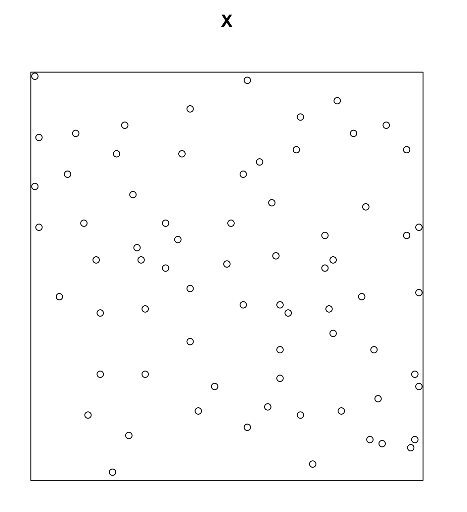
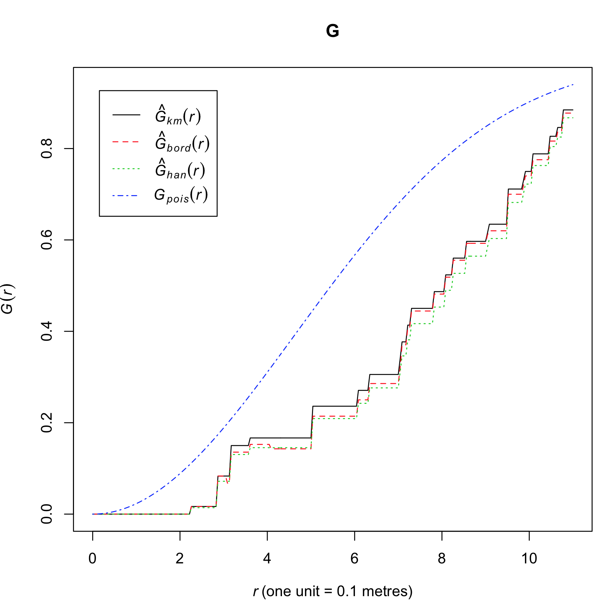
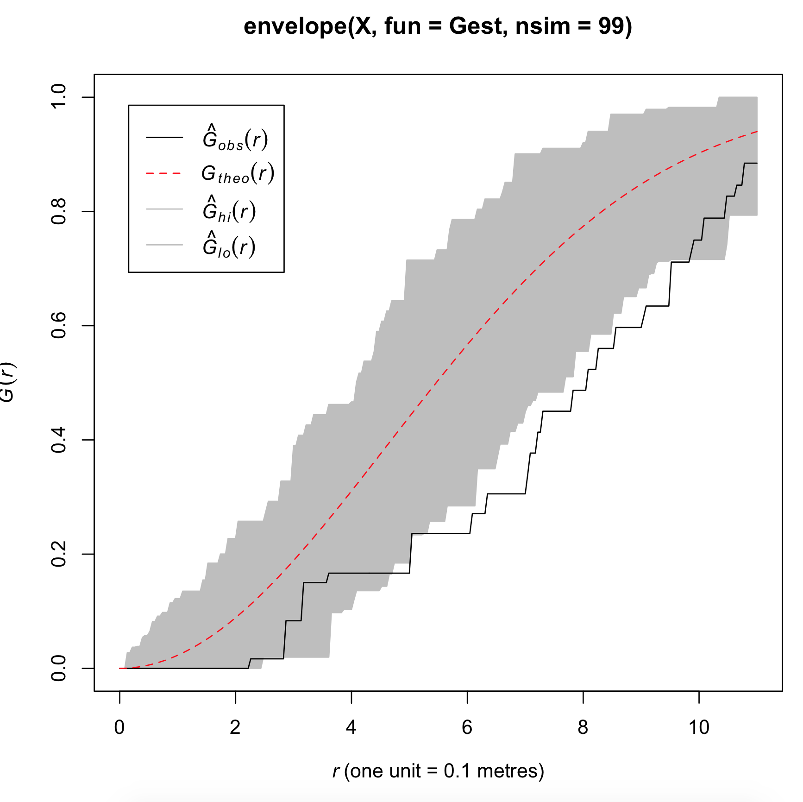

# Simulation

This week we looked a bit at distance and one of the prime uses for distance computations is point pattern analysis.  Last week, we looked at methods to determine whether or not a point pattern was completely spatially random by using some known distribution.  What though, if we did not know the distribution?  What if we had no good way to estimate the distribution or derive what the expected pattern should look like?  To go one step further, what if we see some pattern (with a known or unknown distribution), but want to know if the pattern is statistically significant?  What if we know that our study area is being influenced by [edge-effects](https://en.wikipedia.org/wiki/Boundary_problem_(spatial_analysis)), but still want to perform an analysis to determine if something of interest is going on?  

In all these cases, we can turn to simulation, specifically [Monte Carlo methods](https://en.wikipedia.org/wiki/Monte_Carlo_method).

Monte Carlo simulation finds wide usage in spatial analysis, from point patterns, to regression model formulation, to error analysis.  At the most basic, Monte Carlo simulation is the repeated generation of random numbers.  If we generate enough random numbers, we can start to determine what the underlying distribution is or how we expect the random number to behave.  The process really is not of any use until we add some constraints (like a mean and a standard deviation).  Then we can start to see what the distribution looks like.

We will use point patterns as an example.  Lets say that we have observed some Swedish Pines (available in the R module, spatstat).

We want to run a few statistical tests on this point pattern.  For example, the we might compute the mean centroid first.

$$C = (\bar{x}, \bar{y}) = (\dfrac{\sum_{i=1}^{n}x_{i}}{n}, \dfrac{\sum_{i=1}^{n}y_{i}}{n})$$

This really does not tell us much in this case.  We do not have a large number of observations clustered in one area that might pull the centroid to somewhere of interest.

What might be more interesting is to see if we have clustering (or regularity) at all.  To do this, we can utilize statistics that leverage nearest neighbor distances.  For example, the G function:

$$\hat{G}(d) = \dfrac{count(d_{min}(o_{i}) \leq d, i=1 \cdots N}{N}$$

where count is a simple count of the number of observations, $$o$$, that are $$\leq$$ some distance $$d$$.  If we computed $$\hat{G}(d)$$ at a number of different $$d$$ values, we can start to build a distribution of event-to-nearest event distances.  

The 'stair step' function is the one that is of interest.  This is a cumulative distribution function (which is why the y-axis G(r) goes from 0 (no observations are within that distance) to 1 (all observations have a nearest neighbor within that distance).

How though do we know if any of these distances are significant?  Is the pattern completely noise?  Here we can apply Monte Carlo simulation.  What if we generated 99 other random point patterns and computed G functions 99 times.  This would give us 99 step functions.

Here we see the results of computing 99 G functions and plotting the minimum and maximum values at each $$d$$.  Simulation therefore has been used to generate an envelope, inside which 99% of our tests fall.  It is then up to the person running the analysis to interpret the results and determine if something significant is occuring.

