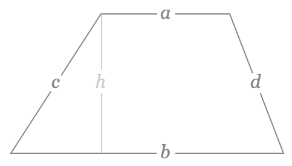

# Area
The first few sections are review of high school geometry for computing the area of triangles, circles, and rectangles.  Knowing these basics, it is possible to compute the area of more complex, geometries.  Feel free to skim the first few sections.

## of a Parallelogram
The formula to compute the area of a rectangle is:

$$A = bh$$, where

$$A$$ is the area, $$b$$ is the length of the base and $$h$$ is the height.

#### Supplemental Video

## of a Triangle

The area of a triangle is computed as:

$$A = \dfrac{h_{b}b}{2}bh$$, where

$$A$$ is the area, $$h_{b}$$ is the height and $$b$$ is the length of the base.

#### Supplemental Video

## of a Trapezoid
The formula for the area of a trapezoid is:

$$A = \dfrac{a + b}{2}h$$, where

$$A$$ is the area, $$a$$ and $$b$$ are the bases of the trapezoid (parallel to each other), and $$h$$ is the height of the trapezoid.

#### Supplemental Video

## of Simple Polygons
Above, the method to compute the area for foundational geometries were described.  In a GISystem, we often want to find the area for more complex geometries.  For example, a parcel might not be a perfect trapezoid.

Please have a look at this video for a walkthrough on computing the area of a simple polygon.

In the example, enough information about line-segment length was provided that it was possible to compute the area.  In a GIS, we might not want to have to step through all of the components of a polygon, compute the length of the line-segments, and then try to decompose a complex geometry into a simple geometry.  Just writing that description, it sounds like a lot of (possibly inefficient) processing steps.  A better way is [Green's Theorem](http://math.blogoverflow.com/2014/06/04/greens-theorem-and-area-of-polygons/).

Please take a look at the link above and read through the blog post.  Pay particular attention to the formulation and usage - the derivation is interesting, but not critical for our use cases.

## of Polygons with Holes
By using Green's Theorem, it is also possible to compute the area of simple polygons with holes.  I will leave it to you to think about how the theorem might need to be applied.

## of Circles
To conclude, the area of a circle is:

$$A = \pi r^{2}$$, where

$$A$$ is the area, $$\pi$$ is the constant pi, and $$r$$ is the radius of the circle.  

#### Supplemental Video

