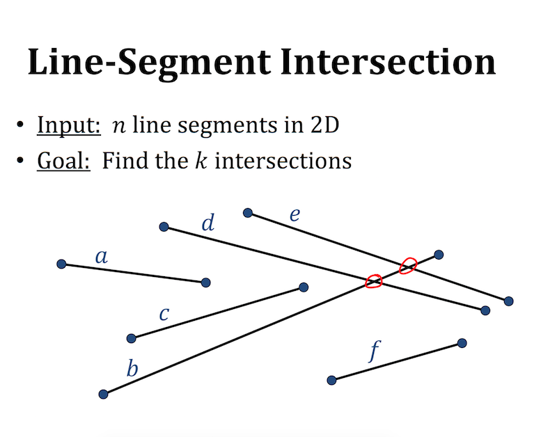
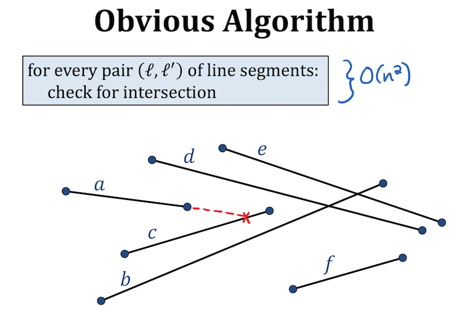
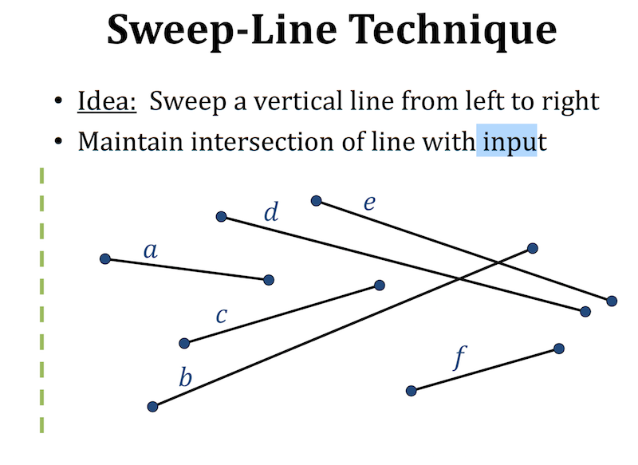
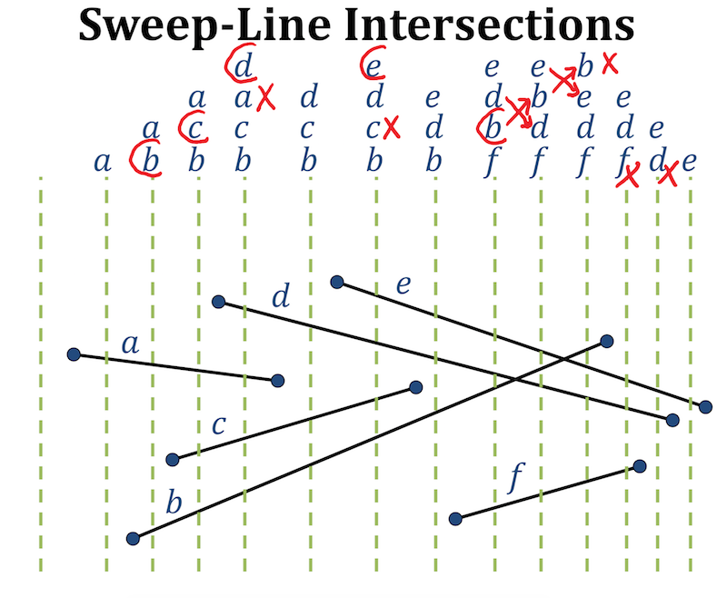
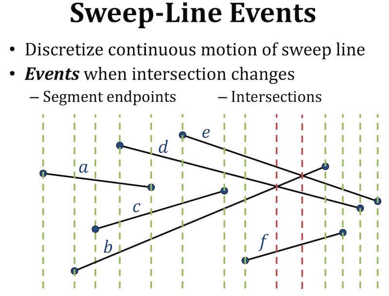

# Line Intersection

First, checkout [this website](https://brilliant.org/wiki/intersections-line-segments/).  Watch the GIF a few times before reading any text.

The previous webpage animation illustrates the identification of Voronoi polygons.  The red, horizontally traversing line, is the sweep line that registers events.  An event is defined as the start or end of a geometry.  The start/stop for a point is identical, while line-segments have (almost always) unique starts and stops[^1].  How then can a line sweep algorithm be used to identify intersecting lines?

The following is modified from [here](https://courses.csail.mit.edu/6.006/spring11/lectures/lec24.pdf).

The data set is composed of six lines a - f.  Our brains can immediately identify intersection between line $$bd$$ and line $$be$$.  As a thought experiment, try to verbalize how you know that those lines intersect.  What underlying thought was applied?

The most obvious way to check for intersection is to select a line and check if it intersects any other lines.  Then repeat for the next line.  This would require $$n^{2}$$ comparisons, where $$n$$ is the number of lines.  We could be a bit more efficient and avoid comparing both $$ab$$ and $$ba$$.  Making this optimization, only $$\dfrac{n^{2}}{2}$$ comparisons.  Unfortunately if $$n = 10^8$$, the result is still an impossibly large number of comparisons!  Remember from last week that a key goal is efficiency.  

So the method is identical to the website linked above.  We pass a horizontal line from left to right (or right to left).

The second bullet in the previous image reads 'Maintain intersection of line with input.'  This image illustrates what that means.  As the line passes from left to right, events are tracked.  The start of a line-segment is an event that requires that the line-segment be added to a list of currently intersected lines.  An end of line-segment events requires that the line be removed from the list of candidates.  Given the above image, how would one decide how frequently to check the sweep line for intersection with the inputs?  For example, look at the start of $$a$$ - the line sweep missed the true start (the vertex).

As alluded to above, the line sweep is a discrete algorithm.  If the x-values of all the line vertices are sorted (from left to right), then the algorithm operates by simply stepping through each vertex.  This way, we never have to define a good increment size of the swepe line - the increment is variable as the line skips to the next start/stop event.

At this point, we have an algorithm that tells us whether line-segment $$a$$ and line-segment $$b$$ have any potential to overlap, but how do we check if these lines do overlap?  The standard method makes use of binary trees (that are outside of the scope of this text).  Instead, we will use a standard algorithm that assumes each line-segment is being defined by two points (as opposed to an equation of a line, for example).

If, $$l_{1}$$ is composed of $$(x_{1}, y_{1})$$ and $$(x_{2}, y_{2})$$ and $$l_{2}$$ is composed of $$(x_{3}, y_{3})$$ and $$(x_{4}, y_{4})$$, then

$$(P_{x}, P_{y}) = (\dfrac{(x_1 y_2)(x_3 - x_4)-(x_1 - x_2)(x_3 y_4 - y_3 x_4)}{(x_1 - x_2)(y_3  - y_4)-(y_1 - y_2)(x_3 - x_4)}, \dfrac{(x_1 y_2 = y_1 x_2)(y_3 - y_4) - (y_1 - y_2)(x_3 y_4 - y_3 x_4)}{(x_1 - x_2)(y_3  - y_4)-(y_1 - y_2)(x_3 - x_4)})$$

$$P$$ is then the intersection point.

[^1]: Events in a line sweep are registered as the x-axis value changes.  A vertical line has start and stop x-values that are identical.  Luckily, the fall-back, brute force algorithm can be infreqently applied when a vertical line is encountered.