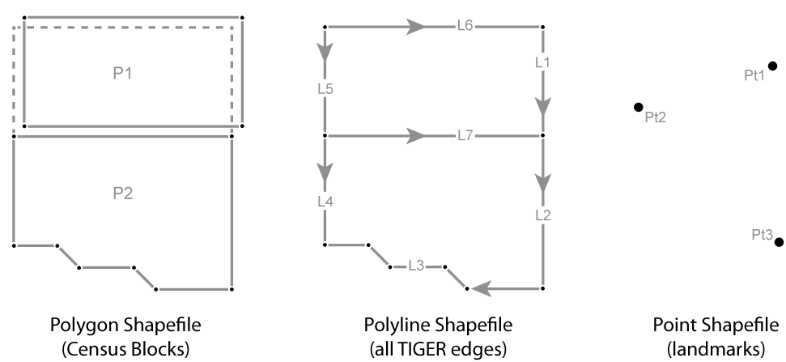
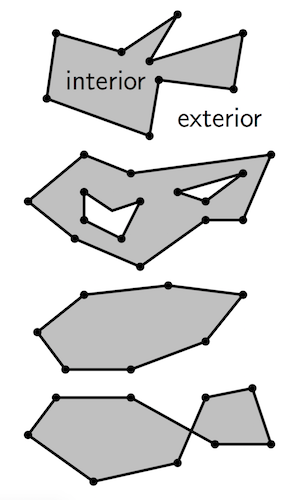

# Introduction

Last week computational geometry, efficiency, and algorithms for operating on points were introduced.  Points were the focus because they are, in some ways, the most simplistic.  It is only necessary to worry about managing a single coordinate.

As a quick aside:
> Points are the lowest dimenstionality (0d) geometries that are represented in a GISystem.  We consider points to be zero-dimensional because they are, theoretically, infintesimally small.  They occupy no space (like a polygon does) and cover no distance (like a line does).  
 

Image from: [https://www.e-education.psu.edu/natureofgeoinfo/c4_p5.html](https://www.e-education.psu.edu/natureofgeoinfo/c4_p5.html)

This week, we will look at 1d (line) and 2d (polygon) geometries.  Along with points, polylines and polygons are foundational representations in GISystems.

## Notation
In the following readings you will encounter some new notation, namely $$\leftarrow$$.  This is an assignment operator.  So, $$A \leftarrow x + y$$, can be read as the sum of x and y is assigned to A.  You will also see $$det$$.  This is the determinant of a matrix (something that we will talk about in the second half of the course - if this is new, no worries.  The take away is that many of the algorithms and methods we are looking at can be made significantly more efficient using matrix (linear algebra) representations.).  Finally, you will see $$\Delta$$ placed next to a variable,, for example $$\Delta x$$.  This notation can be read as the change in.  The above example is then the change in x.

## Lines (Polylines)
Please read sections 3 and 4 focusing on lines and line segments.  Feel free to just skim those sections that are review.  Pay particular attention to the sections on determining if a point is on a line (3.5) and the intersection of line segments (4.5).  

  * [Lines](http://wcipeg.com/wiki/Computational_geometry#Lines)
  * [Line Segments](http://wcipeg.com/wiki/Computational_geometry#Line_segments)

## Polygon

Luckily, in a computational geometry context, polygons are simply an ordered collection of line segments.  Ordering is important because, as was demonstrated last week, concepts of clock-wise and counter-clockwise ordering are essential.

Just like it is possible to define a line as $$l \in \mathbb{R}^{2}$$, where $$l$$ is an infinite number of points that fall along some line in $$\mathbb{R}^{2}$$, it is possible to mathematically define a polygon as $$P \in \mathbb{R}^{2}$$.  $$P$$ is the polygon that is bounded by a finite number of line segments.  The boundary polygons are composed of two elements: edges and vertices.  Four types of polygons that we will focus on are: 

* simple polgyons (1st image);
* polygons with holes (2nd image);
* convex polygons (3rd image);
* non-simple polygons (4th image).  

Image and text from: [http://www.cs.uu.nl/docs/vakken/ga/slides1.pdf](http://www.cs.uu.nl/docs/vakken/ga/slides1.pdf)

Many of the algorithms developed for polygons actually focus on generating the geometry. Within GISystems common polygon creation problems include [Voronoi Diagrams or Thiessen Polygons](https://en.wikipedia.org/wiki/Voronoi_diagram) and [Triangulated Regular Networks](https://en.wikipedia.org/wiki/Triangulated_irregular_network)(TIN).

Working with polygons, algorithms can decompose polygons into component line-segments (for example, for polygon intersection) or can focus on the interatction between different geometries.  For an example of the latter, a common question might be 'is a given point inside a polygon?'.  Answering this question can, as above be decomposed into the independent interaction between a point and some number of line-segments.