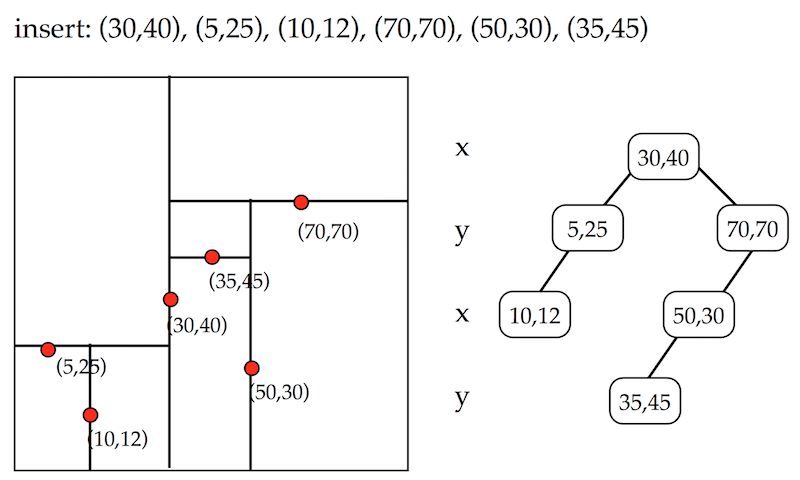

# Trees
Trees are a data sctucture composed of nodes and edges that can make the storage and retrieval of information much more efficient.  Below is an example of a type of tree, called a binary tree.

What does this have to do with computational geometry?  Well, tree data structure find pretty heavy use in computational geometry.  They can be used to make searches (for example, a nearest neighbor search) significantly more efficient.  In this section, we discuss trees pretty abstractly with the goal of having the reader comfortable with what a tree is and what basic operations are performed with a tree.

Here are some properties of trees:

* A tree is composed of nodes (circles in the above) and directed edges (lines in the above).  A directed edges is an edge that can only be traveled in one direction (i.e. a one way street).
* The first node in a tree is the **root**.
* In a binary tree each node has at most two connected nodes.
* The **depth** of a node is the number of edges from the root to the node.  So, the depth of node 11 is 3 and the depth of node 5 is one.
* The **height** of the tree is the number of edges from the root to the most distant (deepest) node.  The tree above has a height of 3.
* A **full binary tree** is a tree in which each node has exactly two or zero nodes.
* A **complete binary tree** is a binary tree that is completely filled.  That is, each node has exactly two children.  The final row is an exception and must only be filled from left to right.  ([Slide 1](http://courses.cs.vt.edu/~cs3114/Fall09/wmcquain/Notes/T03a.BinaryTreeTheorems.pdf) has additional examples).

## Tree Traversal
From: [https://www.cs.cmu.edu/~adamchik/15-121/lectures/Trees/trees.html](https://www.cs.cmu.edu/~adamchik/15-121/lectures/Trees/trees.html)

A traversal is a process that visits all the nodes in the tree. Since a tree is a nonlinear data structure, there is no unique traversal. We will consider several traversal algorithms with we group in the following two kinds

* depth-first traversal
* breadth-first traversal
 
There are three different types of depth-first traversals:

* PreOrder traversal - visit the parent first and then left and right children;
* InOrder traversal - visit the left child, then the parent and the right child;
* PostOrder traversal - visit left child, then the right child and then the parent;

There is only one kind of breadth-first traversal--the level order traversal. This traversal visits nodes by levels from top to bottom and from left to right.
As an example consider the following tree and its four traversals: 

* PreOrder - 8, 5, 9, 7, 1, 12, 2, 4, 11, 3 
* InOrder - 9, 5, 1, 7, 2, 12, 8, 4, 3, 11 
* PostOrder - 9, 1, 2, 12, 7, 5, 3, 11, 4, 8 
* LevelOrder - 8, 5, 4, 9, 7, 11, 1, 12, 3, 2	  

## Searching
More specifically, building and searching in a KD-Tree (a special kind of binary tree).  This application is 100% applicable to a GIS.  When you ask a nearest neighbor question, 99% of the time, you the underlying functionality is using a KD-Tree.
 

Image from: [https://www.cs.umd.edu/class/spring2008/cmsc420/L19.kd-trees.pdf](https://www.cs.umd.edu/class/spring2008/cmsc420/L19.kd-trees.pdf)

Here we have two different data structures, a point data set (on the left) and a corresponding kd-tree (on the right).  The point data set has the coordinates illustrated, as well as vertical and horizontal lines.  These lines are partitioning lines that define membership in the kd-tree.  The root node(30,40), was selected because it is roughly in the middle of the data set.  The vertical line indicates that the x-value was selected for partitioning.  The next two selected nodes were (5,25) and (70,70).  These two points vertically partitioned the space to the left and right, respectively, of point (30,40).  The 2d space is recursively partitioned, with children identified for each new level until all points are invluded in the kd-tree.  So, the tree is created by slicing the space into smaller and smaller pieces.  Why would we want to do this?

We know that binary trees can be search very quickly and that the brute force point comparison is as inefficient as the previsouly described brute force line comparison ($$O(n^{2})$$).  In the worst case, to find the nearest neighbor, we might need to search the entire tree.  In practice, this is very (very, very, ....) rare.  Stepping through the nearest neighbor search algorithm is a great idea (for a programming course) and not something that I want to include here.  What the take aways should be are:

* trees are efficient models for storing and searching for information.
* trees have a set of properties that can be used to describe them
* trees have immediate applicability to problems solved within a GIS, such as nearest neighbor search
* additional complexity in the formulation of problems to use trees is offset by the above mention efficiency.