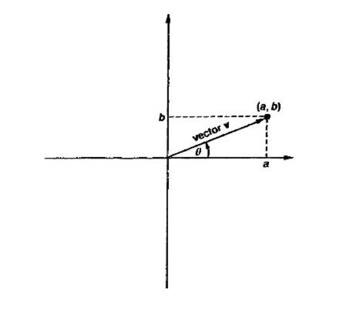
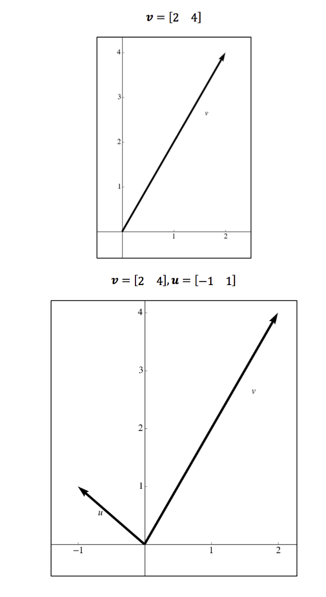
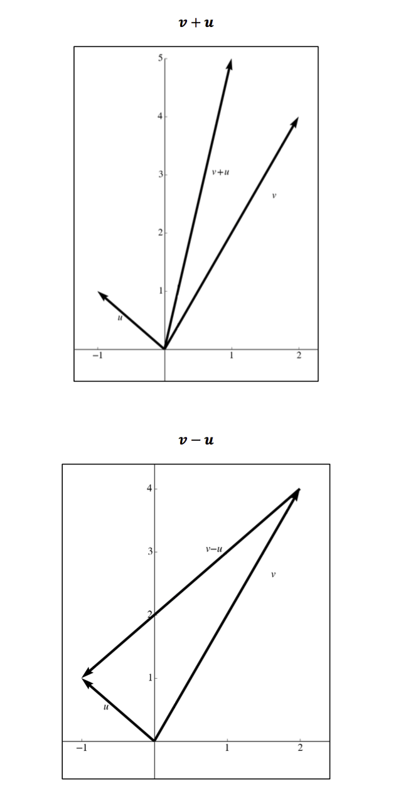

# Graphical Representation

## Vector

A vector is a matrix that has a single row of column.  A $$m x 1$$ matrix is a row vector and a $$1 x n$$ matrix is a column vector.

[ 1 2 3 ]

and 

$$\begin{bmatrix}
1 \\
2 \\
3
\end{bmatrix}$$.

The elements of the vector are called components and the dimension of a vector is the number of components.  Vectors are generally notated as *lowercase bold-face* letters: \textbf{y} or \textbf{u}.

## Geometry of Vectors
Two dimensional and three dimensional vectors can be represented geometrically. Let say we have a two dimensional vector $$mathbf{v} = \begin{bmatrix} a & b \end{bmatrix}$$. It can be represented as an arrow beginning from at the origin (0, 0) and ending at point $$(a, b)$$.

	

Two vectors of the same size can be added componentwise like matrices.  Vector addition can be represented geometrically.

