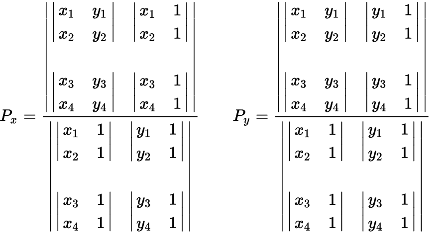

# Line Intersection

In Chapter 7, section 4 a line intersection algorithm was presented.  Once the line sweep had identified potential intersection, it was necessary to check for an actual intersection using:

$$(P_{x}, P_{y}) = (\dfrac{(x_1 y_2)(x_3 - x_4)-(x_1 - x_2)(x_3 y_4 - y_3 x_4)}{(x_1 - x_2)(y_3  - y_4)-(y_1 - y_2)(x_3 - x_4)}, \dfrac{(x_1 y_2 = y_1 x_2)(y_3 - y_4) - (y_1 - y_2)(x_3 y_4 - y_3 x_4)}{(x_1 - x_2)(y_3  - y_4)-(y_1 - y_2)(x_3 - x_4)})$$

The above is simply determinants written out!  It is possible to compute the above using:

