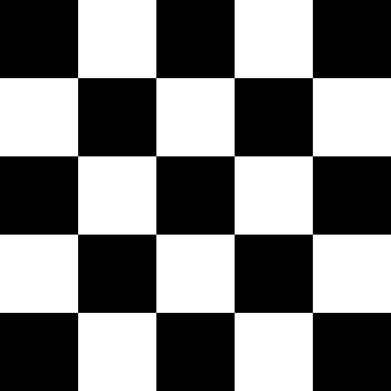
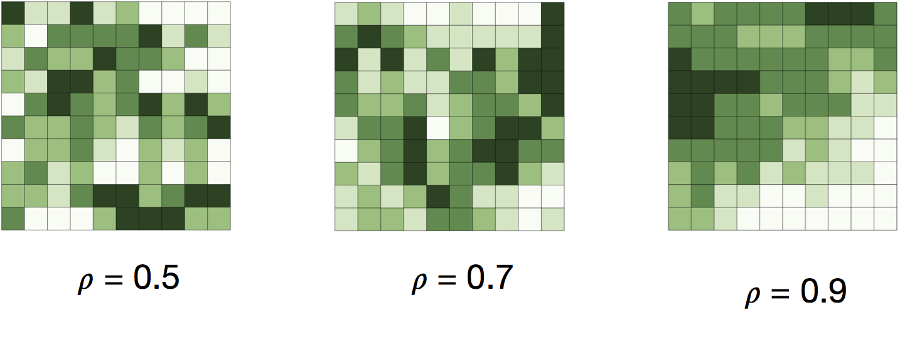

# Case Study: Moran's I

In the previous section the value $$\rho$$ was introduced and then largely ignored.  $$\rho$$, or the spatial autoregressive term is a measure of the level of spatial autocorrelation that ranges from -1 to 1.  Below is an example of lattice data (a regular grid of polygons) that would be perfectly negatively spatially autocorrelated (so $$\rho = -1$$).

And here is another example with varying degrees of spatial autocorrelation:

The Moran's I statistics is a method for estimating $$\rho$$, the level of spatial autocorrelation.  Formally, Moran's I is formulated as:

$$I = \dfrac{N}{\sum_{i}\sum_{j}w_{ij}} \dfrac{\sum_{i}\sum_{j}w_{ij}(X_{i}-\bar{X})(X_{j} - \bar{X})}{\sum_{i}(X_{i} - \bar{X})^{2}}$$, 

where $$N$$ is the total number of spatial units indexed by $$i$$ and $$j$$, $$X$$ is some variable of interest associated with each $$N$$ and $$\bar{X}$$ is the mean of the variable, and $$w_{ij}$$ is the now familiar spatial weights object.

One question in the assignment this week will ask you to compute a Moran's I score for a toy data set.
