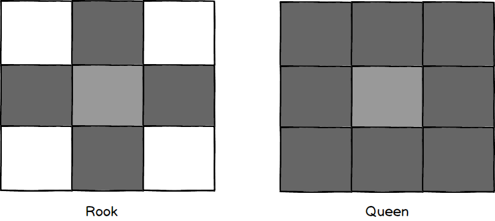

# Spatial Weights
Spatial weights are a mathematical representation the interaction or adjacenccy between spatial entities.  Spatial weights seek to model the spatial interaction between entities so that classic statistical analysis techniques, such as ordinary least squares regression, can be applied and the results interpreted.

Traditionally, the spatial weights object is notated as $$\mathbf{W}$$.  The spatial weights object is a square matrix with 1 along the diagonal and some measure of interaction in each element.

For example:

$$\mathbf{W} = \begin{bmatrix}
1 & w_{21} & w_{31} \\ 
w_{12} & 1 & w_{32} \\
w_{13} & w_{23} & 1
\end{bmatrix}$$

where the first element $$w_{11}$$ is the weight between observation *a* and itself and  $$w_{21}$$ is the interaction between observation $$a$$ and observation $$b$$.  Finally, $$w_{31}$$ is the interaction between observation $$a$$ and observation $$c$$.  The next row(s) repeat the process for the other observations in the $$\mathbf{W}$$ object. It should be clear why the diagonal is one; this element captures the interaction between an observation and itself (a self-neighbor).

## Concepts of Contiguity
Adjacency can be modelled using many techniques.  Commonly adjacency is binary; either two entities share a common border or they do not.  For example:

This simple lattice illustrates 9 areal units, resulting in a dense $$9 x 9$$ $$\mathbf{W}$$ object.  Utilizing the *Rook* contiguity criteria, the areal units are adjacent if and only if they share a common edge.  For example, if the element numering begins in the top left in the form:

$$\begin{bmatrix}
1 & 2 & 3 \\
4 & 5 & 6 \\
7 & 8 & 9
\end{bmatrix}
$$

the columns of the $\mathbf{W}$ would correspond (left to right or top to bottom for the rows) to units 1-9 and the resultant spatial weights matrix would be:

$$\mathbf{W} = \begin{bmatrix}
1 & 1 & 0 & 1 & 0 & 0 & 0 & 0 & 0 \\
1 & 1 & 1 & 0 & 1 & 0 & 0 & 0 & 0 \\
0 & 1 & 1 & 0 & 0 & 1 & 0 & 0 & 0 \\
1 & 0 & 0 & 1 & 1 & 0 & 1 & 0 & 0 \\
0 & 1 & 0 & 1 & 1 & 1 & 0 & 1 & 0 \\
0 & 0 & 1 & 0 & 1 & 1 & 0 & 0 & 1 \\
0 & 0 & 0 & 1 & 0 & 0 & 1 & 1 & 0 \\
0 & 0 & 0 & 0 & 1 & 0 & 1 & 1 & 1 \\
0 & 0 & 0 & 0 & 0 & 1 & 0 & 1 & 1
\end{bmatrix}$$

The exact same principal holds true for the queen case, except now the adjacency criteria requires that only a vertex be shared.

Weights object can also be derived using other metrics.  For example, the above are binary, in that units either are, or are not adjacent.  It is also possible to utilize some distance criteria and to generate a continuous weight.  For example, if we sought to model the spatial autocorrelation in crime rates, we might not case that two census blocks are adjacent.  Instead, we might think that raw distance is more important and so all elements in the $$\mathbf{W}$$ would be filled using some function (inverse weight of the distance between centroids perhaps).  

## Normalization
Before use in a a spatial statistics, it is common to row standardize a spatial weights object.  The process of normalization is a widely used statistical method to allow for 'apples-to-apples' comparisons of values.  By way of an example:

> Imagine that I showed you a map of the number of 'happy' tweets collected for every county in the U.S.  This is a raw count, so I would guess that New York City will have more happy tweets than Flagstaff.  Does this mean that NYC is a happier place than Flagstaff?  Using the unnormalized values, we have no idea.  The raw counts could be a proxy for twitter usage, which could be a proxy for population.  So, the unnormalized values are really just population density (or $$f(population)$$ if we want to try and estimate twitter usage).  If we normalize (divide) the counts by the total population (or area, or some other appropriate value) then an 'apples-to-apples' comparison is possible.  Without normalization, inference is impossible!

With a spatial weights object if we do not normalize, those entries (rows) that have a higher number of neighbors (a higher cardinality) will bias the statistic.  They carry more weight than they should.  The inverse is also true.  Those entries with lower neighbor counts are being under represented.  To normalize, we count the total number of non-zero elements in a row ($$n$$), and then divide all non-zero elements by $$n$$.  If

$$\mathbf{W} = \begin{bmatrix}
1 & 1 & 0 & 1 & 0 & 0 & 0 & 0 & 0 \\
1 & 1 & 1 & 0 & 1 & 0 & 0 & 0 & 0 \\
0 & 1 & 1 & 0 & 0 & 1 & 0 & 0 & 0 \\
1 & 0 & 0 & 1 & 1 & 0 & 1 & 0 & 0 \\
0 & 1 & 0 & 1 & 1 & 1 & 0 & 1 & 0 \\
0 & 0 & 1 & 0 & 1 & 1 & 0 & 0 & 1 \\
0 & 0 & 0 & 1 & 0 & 0 & 1 & 1 & 0 \\
0 & 0 & 0 & 0 & 1 & 0 & 1 & 1 & 1 \\
0 & 0 & 0 & 0 & 0 & 1 & 0 & 1 & 1
\end{bmatrix}$$

then the vector of denominators is:

$$\begin{bmatrix}
3 \\
4 \\
3 \\
4 \\
5 \\
4 \\
3 \\
4 \\
3 
\end{bmatrix}$$

and the normalized $$\mathbf{W}$$ is:

$$\mathbf{W} = \begin{bmatrix}
1/3 & 1/3 & 0 & 1/3 & 0 & 0 & 0 & 0 & 0 \\
1/4 & 1/4 & 1/4 & 0 & 1/4 & 0 & 0 & 0 & 0 \\
0 & 1/3 & 1/3 & 0 & 0 & 1/3 & 0 & 0 & 0 \\
1/4 & 0 & 0 & 1/4 & 1/4 & 0 & 1/4 & 0 & 0 \\
0 & 1/5 & 0 & 1/5 & 1/5 & 1/5 & 0 & 1/5 & 0 \\
0 & 0 & 1/4 & 0 & 1/4 & 1/4 & 0 & 0 & 1/4 \\
0 & 0 & 0 & 1/3 & 0 & 0 & 1/3 & 1/3 & 0 \\
0 & 0 & 0 & 0 & 1/4 & 0 & 1/4 & 1/4 & 1/4 \\
0 & 0 & 0 & 0 & 0 & 1/3 & 0 & 1/3 & 1/3
\end{bmatrix}$$
 
## Descriptive Statistics
The $$\mathbf{W}$$ object is useful not only within spatial statistics, but also on its own and a number of descriptive statistics can be used to provide additional insight.

* Cardinality: Above I briefly mentions the idea of cardinality, or how many neighbors does a given observation have.  It is trivial to compute this metric for the entire $$\mathbf{W}$$ objecet and then generate a histogram (binning) of cardinalities.  Those entries with extremely high (or) low cardinalities can frequently be of interest.
* Determinant: 
* Eigen Values / Vectors:
* 

